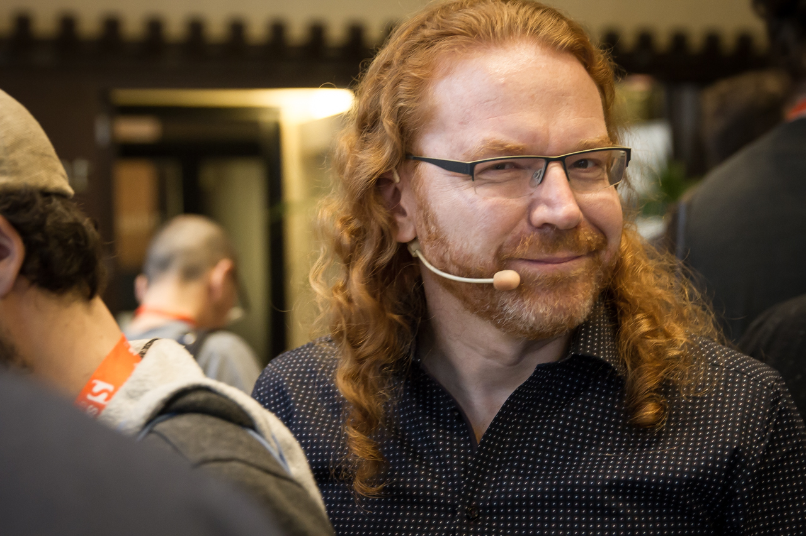

# About this handbook

This handbook will get you on the way to be a great developer advocate
for any product or company. Naturally, your approach may need tweaking for
different markets and audiences -- and in accordance with your own
personality -- but the main principles are the same for everybody and
anywhere in the world.

Developer advocacy is a comparatively new field of work and the first
hurdle you will encounter is people asking what a developer advocate is
and why any company would need a role like that.

Eleven years ago I wrote this book for exactly that reason. I had hit a
wall in my career. I was a lead developer and the next and only role to
get higher up the ladder for me was manager, which I didn't want to do.
I already had started reaching out to developers about my company, but
there was no recognition for it as it plain and simply wasn't
my job. This is why I came up with the role of "developer evangelist"
not only as a good idea, but as a full time job in a technical company.
Lucky for me, the company agreed that it would be a beneficial thing to
do. That's why I wrote this handbook to help other people to get the
same opportunity.

# About this version

Fast forward to now. I had a long career as a "developer evangelist" in
a few companies and this handbook has inspired a lot of people to go the
same route. Developer Relations (DevRel) with all its different roles is
a much more common market now. Many companies have taken on the ideas
outlined here and in the follow-up books, posts and videos. 
There are dedicated mailing lists, communities and even
conferences that don't only feature DevRel people but are exclusively about
DevRel.

Naturally this brought a lot of change along the way. I also stepped
back from the role of Developer Relations and went into Program
Management. Mainly because I found it time to let other people bring in their
ideas and skills that speak to a newer audience.

When someone approached me about a print version of this book, I took a
look at it again. I found it at times quaintly outdated, speaking about
now defunct tools and products, but the general message and ideas still
valid. Even more so, that in a world where you can drown in an avalanche
of information about developer advocacy, I took a "zoom out" approach
and concentrated on what you should consider and achieve and not the how
and which products to use to get there.

I also took a deliberate renaming approach from Developer Evangelism to
Developer Advocacy. The reason is that Evangelism is a religiously
loaded term, whereas advocacy has a nicer ring to it. You are the
advocate for the developer world -- the voice to the outside and the
person asking for great developer experiences inside your company.

# About the author

{:height="1280" width="853"}

Christian Heilmann has been working as a web developer for over 20 years
and spent the last 10 as a developer evangelist/advocate for companies
like Yahoo, Mozilla and Microsoft. He spent his time speaking on average
at about 20 conferences a year and lead teams of developers and
developer advocates. He published two books and contributed to 6 more.
He's been content editor for various online magazines and originally
worked as a radio journalist before he considered the web his new home.
He blogs since 2005 at [christianheilmann.com](https://christianheilmann.com) 
and can be found on Twitter as the name of [codepo8](https://twitter.com/codepo8). 
He lived and worked in Germany, India, United States and the UK. 
He currently lives in Berlin, Germany and works as a Principal Program Manager at Microsoft.
