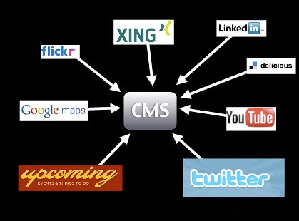

# Create great slide decks for presentations

{:height="900" width="1600"}

A good slide deck is a companion to your presentation. It should underscore
what you say and get people excited about the subject matter. In a perfect
example each slide should be able to be on its own and together they describe a
story you as the presenter should tell.

## Illustrate, don\'t transcribe

Once you wrote your content and picked the right tool it is time to
write your slides. As mentioned before, what you should remember here is
that your slides are not your presentation but its outline. The slides
are there to keep your narration flowing and illustrate to the audience
what you are on about at this point in your talk.

Human communication is to a large part body language and you standing
there and reading from your slide deck or --even worse-- turning away
from your audience to see what happens on the big screen is
a communication disaster.

In addition to that it means that you cannot concentrate on the
audience. Checking the audience and their body language is a large part
of giving a good presentation.

> **Fact:** Presenting is not about you celebrating yourself and performing a show but about you bringing information to the audience in an engaging and interesting way.

You can only do that when you can see the effect you have -- not when you
have to read what you want to say.

Thus you need to find a single sentence or even a word, a picture, a
screenshot, some graph or some illustration that explains and
accentuates what you want to talk about in this segment of your
presentation. You don\'t overwhelm the audience with things to
read and look at but enable them to concentrate on you. You free yourself
in your delivery and -- if needed -- alter your delivery style to stop
the audience from nodding off or leaving.

Let\'s have a quick example from a long time ago. The following
information is what I had [in my
notes](https://christianheilmann.com/2009/08/18/domainconvergence/):

The way to have fun with the web of data is to distribute ourselves
around the web and bring the data back to our sites.

The first step is to spread our content on the web:

* upload photos to [Flickr](https://flickr.com/)
* bookmark and tag URLs at [Delicious](http://del.icio.us/) (that was long ago)
* write short and succinct news updates at [Twitter](https://twitter.com/)
* upload videos to [YouTube](https://www.youtube.com/)
* link addresses and set up driving instructions with [Google Maps](https://www.google.com/maps)
* update CVs and bios at [XING](https://www.xing.com/) or [LinkedIn](https://www.linkedin.com/)

The benefits of this approach are the following:

* The data is distributed over multiple servers -- even if your own web site is offline (for example for maintenance) the data lives on.
* You reach users and tap into communities that would never have ended up on your web site.
* You get tags and comments about your content from these sites. These can become keywords and guidelines for you to write relevant copy on your main site in the future. You know what people want to hear about rather than guessing it.
* Comments on these sites also mean you start a channel of communication with users of the web that happens naturally instead of sending them to a complex contact form.
* You don't need to worry about converting image or video materials into web formats -- the sites that were built exactly for that purpose automatically do that for you.
* You allow other people to embed your content into their products and can thus piggy-back on their success and integrity.

The two slides that went with the information above where the following:

{:width="419" height="310"}

{:width="418" height="304"}

Instead of telling all of these things, I gave people a visual, using
the logos of the companies as something they already know and showing
with a few arrows what I want to bring across. I was able to talk
through the services one by one and say what people can do with them.
The second slide then showed the benefit of piggy-backing on the
integrity of these services. Add a practical example of what can be done
with this approach and you have yourself a great segment of a talk.

> **Warning:** As you can see in this example, spreading your information on
the web can become a relatively short-lived experience. A lot of these
services are now defunct whilst my blog still loves on. One important
bit to remember when it comes to your presence on the web is to always
keep a local copy of your content you could import into a new service in
the future. Also, if any service you use doesn't give you options to
export your own data, that's a warning sign.

## Use and find images

**Images can be a great way of getting a message across**. You\'ve
probably seen beautiful presentations with inspiring pictures of
swooping eagles and calm waterfalls but this is becoming cliché really
fast.

I use images for two reasons: to have something unexpected and fun (yes,
mostly kittens) in my slides or to connect to a real life scenario.

> **Example:** When giving a security talk instead of showing a web site
with a security flaw I show a lock that has been picked, or a badly
locking door, or something similar that bridges the gap between a hard
to grasp concept and something that is obviously a problem or a bad
solution. If I talk about badly implemented accessibility I don\'t show
ugly web sites but a wheelchair ramp with a step in it or a wheelchair
accessible toilet behind a door that is too narrow.

**Use imagery to illustrate your point, not to \"make it pretty\"**.
Pretty imagery might be more distracting than helping and for making it
pretty you got colours and typography.

**Finding images to use these days is easy**. There are various
resources that offer free to use imagery and frankly most phones have
good enough cameras that you could take the photo yourself. Don't get
beat up on having to have the perfect shot when a good enough one does
the trick. Slides are there to aid your presentation. They are
wallpaper to your performance.

> **Example:** Say, for example, you want the photo of a lock, [check this
search
link](https://www.flickr.com/search/?l=commderiv&mt=all&adv=1&w=all&q=lock&m=text).
Each of these photos you can use in your slides and all you have to do
is to thank the original photographer by mentioning them by name. I
normally include the URL of the photo on Flickr in the slide, too, so
that other people can re-use the photo if they want to.

No need for expensive stock photography of multi-ethnic people in suits
high-fiving or shaking hands - tap into and participate in [Creative
Commons](https://creativecommons.org/) and we all have more interesting
slides.

> **Warning:** Make sure that you really have the right to use the image.
Whilst it is unlikely that you'll get sued for using a photo in your
talks there have been instances of people using seemingly "free"
resources that ripped of artists. You want to get paid for your work,
too. So make sure that where you found the image is also where it
originated.

**Screenshots are amazingly powerful**. Instead of pointing out a
resource on the web your audience can check later, make a screenshot of
the web site and overlay the URL on the slide. That way people have a
visual idea of what the resource looks like and get a much stronger \"Oh
I remember this\" moment when they visit it. The same applies to
interfaces of systems -- if you show and explain you reach more people
than when you just explain.

> **Tip:** Most operating systems have a built-in editor to add
annotations to an image like arrows, highlight parts of them or add
some text. Make sure to repeat these additions in the alternative
description, too.

## About code examples

Code examples are what a lot of presenters spend far too much time on
getting right. You want a good mix of readability and at the same time
make it easy for you to change the code. Presentation software by
default is not meant for code display. There is no monospace setting,
quotes get replaced by \"smart\" quotes, indentation is all wrong, you
have less space than in your code editor and many other problems.

Code examples, however, are important as they show people how they can
immediately use what you are talking about and you bring the topic you
cover into an area where they feel home. Showing a few lines of code and
what they do in a browser is much more powerful than talking about the
amazing features of the product you talk about. It comes back to the
\"what is in it for me?\" that you should always try to answer with your
advocacy.

Here\'s what I do: I write the code in my normal editor, bump up the
font size a bit and then take screenshots. This has a few benefits:

* **I have colour coding** which increases readability and helps understanding the code.
* **I have the right font and code layout** and none of the \"magic quotes\" annoyances.
* **I maintain the code in one spot** and a code change means simply having to create another screen shot.

Provide live demos and downloadable source packages of your code as explained in the "[Write excellent code examples](write-excellent-code-examples)" chapter and everybody wins.

## Sound and videos

Sound and video are powerful tools for training and illustrating. For
example I found that a two minute screencast of some system makes it
much easier for people to find their way into it than lots of
clever text. You need text anyways cause not everybody can see and
hear video. In presentations, however, I find it more distracting and
anything else. Yes, it enriches your slides and teleports you into the
post 1990 presentation league, but let\'s face it -- it is also terribly
interrupting.

As a presenter you normally want to be the person listened to. You also
can use your body language to emphasize the message you want to give.
From time to time you point out information on your slides but you bring
people back to your narration. If you use music or video in a
presentation you create a pause as all the senses of the audience are
busy following what is going on on the screen. It also creates some time
in your presentation where you are part of the audience as you turn and
watch the screen (facing the audience while they watch a video is
creepy).

Given the disruptive nature of multimedia elements I try to avoid them
whenever I can. They look cool but you\'ll find soon that they are more
hassle than they are worth. For example:

* You expect the AV equipment to be able to show video and have audio for you and your computer (good luck with that one).
* You expect the projector to be able to show video.
* You make your slide deck impossible to distribute unless you turn it into a video.
* You lose the rhythm of your talk, in essence you create a break that you need to pull people out of again.

That doesn\'t mean you cannot talk about videos and screencasts. I
normally upload them to YouTube, take a screenshot of them and show them
as a slide together with the YouTube URL (which I can link and also
provide in the HTML notes). That way you can talk about the video and
don\'t lose five minutes of your presentation. You can also explain what
happens in the video and how it is relevant to what you are talking
about. And people who can\'t see videos still have an idea what is going
on.

> **Tip:** An exception here are screencasts, which I am a big fan of. Instead
of clicking around an interface and entering live data it makes sense to
record a screencast and then talk over it. The distribution problem
still happens, but I found a lot less conference set-ups having an issue
with soundless video than with real "movies" that need sound.

> **Example:** Another exception to my rule is when you want to provoke an
emotional response and make people understand something beyond
their own experience that is very human. One example is that when I talked
about the accessible version of YouTube I created a long time ago.
Rather than me explaining what effect these changes to the interface had
it was more powerful to show [how Lizzie, a user with learning disabilities](http://www.youtube.com/watch?v=CwsDKaalgq8) and [Kirin, a blind user](http://www.youtube.com/watch?v=QiuT0y0KR6I) were able to enjoy online video. Especially Kirin\'s end sentence \"The thing is the power
... this has given me the power that it should give me in the
beginning.\" is a wonderful emotional moment to get you back into your
talk.

If you really feel that you need to use video or audio in your talk then
use it at the beginning or the end of it. That way you either come in as
a spectator and turn into the presenter or get out on the same level as
the audience. In most cases video and audio are extra bells and
whistles. And a good talk doesn\'t need those. This also applies to
transitions and effects.

## Don\'t bling it up

A lot of presenters are happy to use every transition and animation the
presentation software comes with. But that doesn\'t make it better --
especially when they look bad on a slow computer. Animation rhymes with
moderation and this is what you should always keep in mind. You want to
make a point with your presentation and not overload the audience with
whooshes and blinking shiny things that distract from your content. Use
transitions to make your slides smoother, use animation if you want to
reveal something bit by bit and avoid having to jump from slide to
slide.

> **Example:** I like to use \"fade through colour\" as the transition
effect between my slides which smoothly fades in and out in a second. I
only use animation when showing screen shots and showing zoomed smaller
parts overlaid or to focus on one part of an interface.

Used correctly, animation can be a very powerful tool to make a step by
step process more obvious. If you are not skilled in usability and
design though it will most likely appear tacked on and, yes, tacky, as
animation has been traditionally used to spice up very boring
presentations.

The other issue is that animations can actually work against the flow of
your presentation. Sometimes you want to speed things up and if you
hard-wired long and complex animations you stand there waiting for your
slides to catch up with your narration. Sometimes you also have AV
equipment that cannot show animations and that makes you wait for
something that never happens.

> **Example:** When I was in once at a university my talk was streamed on
a video service of the university which meant the streaming server had
to remotely connect into my laptop. As everything is wonky over VPN
neither the animations nor the transitions worked.

## Keep it brief

**Keep your talks brief and if possible cover one topic**. If you need
to cover more than one make sure that you have a good narration flow
from one to the other to avoid them appearing stitched together.
Presentations should bring home one message and that one well. This
could consist of several sections but the overall story should be
obvious. Try to give the whole talk one main theme and return to this in
each of the sections.

As mentioned earlier, your slides should contain only what is necessary
and not more. There is no point in reading from your slides as that
would make you a member of the audience and you have a race who can read
it faster. I tend to have either only a theme per slide or one sentence
and I try to avoid bullet-lists at all costs -- especially nested ones.
These are old school presentation style and conjure up unpleasant
memories of having to sit through two days of boring training sessions.

As mentioned earlier, an agenda up front can be a good idea if you cover
a lot of things but it also allows the audience to pick their faves and
shut down in between. This probably means they miss important parts of
your talk. If you do a good job as a presenter the amount of slides is
not a problem and neither is at which stage of the overall talk you are.
People will be lead through it without realising it. The overall amount
of slides is only limited by your ability to go through them quickly. My
rough estimate is a slide a minute but I am also a very fast speaker.

## Consider the audience

One instance where I break my own rules of brevity is when the audience
consists of people who do not speak my language natively and might have a
harder time keeping up with my pace and accent. When dealing with an
audience like this, having a simple sentence per slide or even some
bullet points and repeating them has quite an impact.

* **You keep things much more simple** and thus you don\'t make the audience feel inadequate or that they are missing important things.
* **You are forced to pace yourself** which is very important with an audience like that anyways.
* **You allow for better translation** in case you get transcribed afterwards or have live translation at the conference.

In these scenarios I also tend to keep my slides much more technical.
Code is international and people can repeat it and write
essays about it in their own languages.

Another thing to remember when giving presentations in different
cultures is that pop references and puns do not work. Don\'t expect the
audience to know what you know and to be excited about what you are
excited about.

> **Example:** When I went to Sweden to give a talk I put in some slides
about the [Swedish Chef from the Muppet Show (here in my favourite
sketch of all time -- \"Chocolate
Moose\")](https://www.youtube.com/watch?v=CAsYwW7pt7o). Nobody got it as
the chef is obviously not called Swedish in the Swedish version of the show. I
also added a \"have a break, have a Kit-Kat\" joke in there, and this
was another ad only aired in the UK. I only knew it from \"world\'s
funniest TV ads\" on German TV. Either reference landed like a lead balloon
and didn't add to the talk at all.

As stated at the beginning, a lot of the tips here are for creating
presentations for developer crowds. If you speak mostly to designers, PMs or
management, other tactics have to be applied. All in all it is a good
idea to question the classic way of presenting and slide design though.

## Corporate and conference templates

During your job as a developer advocate you will be asked to use
conference or corporate slide templates. Try to avoid doing that. The
reason is that these templates are almost all the time targeted to the
classic presentation style of one heading and dozens of nested bullet points
followed by a copyright line nobody cares about and other legalese.

The reason is that using a corporate or conference template is good for
the conference and the company but distracts you as a presenter -- it is
just not you. You and only you should own and run the presentation as it
is your integrity on the line. Once a conference or company asked you to
be a speaker for them they already trust you to do things right and
there is no need to keep the corporate hat on and do a song and dance.

That said, there is a benefit to using these templates. In the corporate
case you show a consistent look and feel to the world and align yourself
with other publications. The question is if you want that. In my case,
not looking like the slide decks of my company battles a lot of
prejudices developers have as developers do not trust big brands. This
is for you to decide. In the case of a conference looking the same as
the others makes your deck more findable later on but at the price of
looking the same as everybody else and having a distracting logo on each
slide.

**The solution is to meet half way.** If you make the first page of your
deck align with the others and then switch to your own style everybody
wins. The cover sheet of your deck is only important in two cases:

* To fill the screen until your talk starts
* As an eye-catcher when you later on send out the deck and show it in a blog post.
* As a preview of the video recording of the talk

Other than that the slides should take the backseat and aid your
presentation.

## Don\'t reuse without personalising

Another very common thing that will happen to you once you become a
speaker for your organisation is that you will be handed presentation
decks to present. \"This has been done by Stephen from the US office and
has been signed off by PR. Stephen can\'t come to the conference, so we
want you to fill in for him. Here are his slides, good luck.\" is
something you will hear a lot.

**If that happens to you, be firm and say that this is not how it
works**. You are a presenter -- not a parrot. If the slides are not in
your language, mirror your approach to a certain topic or talk about
technology or products you are not firm in or have no control over you
are treading on very thin ice. It is you on the line as the speaker and
the success of your talk stands and falls with how you come across. If
you can\'t be you, then don\'t do it.

That said, nothing stops you from using the information on the slide
deck and translating it to your \"language\". Instead of flat out refusing
to use the deck say that you are happy to take over and use the
information but that you want to have a chat and information hand-over
from the original author. Every speaker has extra information that makes
slides make more sense and become more appealing and you cannot guess
these things -- you need to hear them \"from the horse\'s mouth\".

It boils down to this: giving the talk is one half of the whole show.
You will have to answer questions and you will have to be able to
explain the practical implementation of a certain technology or product.
This you can only do when you played with it yourself and verified your
findings with an expert.

Slide decks that get re-used without being challenged and changed become
stale. For a company it makes more sense to keep a repository of facts
and ways to explain a certain product than full slide decks. That way
your information doesn\'t become stale.

## Share and enjoy

Once you\'re done with your slides and you are happy with them, don\'t
forget that sharing is caring.

This could happen internally and externally. Sharing your decks in
the company in a remix-able format is a great way to inform your company
of your work and allows people to re-use your approach to
explaining different products. It is great training material for
other people in the company who are interested in presenting more or
plan to become developer advocates themselves.

Upload the deck to your blog, make it available as a download or -- even
better -- upload it to a slide sharing resource. There are various great
tools to get your slides distributed. People can comment on them, share
them with friends, embed your slides in conference blog posts or as a
resource for a certain subject and many things more. They are what Flickr
was to photos and YouTube is to videos.

Sharing your slides is what a lot of people in the audience will ask you
to do and it will get you known as a speaker. People may stumble upon
your decks somewhere else and learn about you that way.

## Additional presentation tips

The following are some tips that worked very well in the past for me. As
you are not me, you might want to tweak them a bit. So here\'s what I do
when I give presentations.

### Introduce yourself

Introducing yourself -- however briefly -- breaks down an initial
barrier. You are not any longer this unreachable person on stage or at
the head of the table -- you are a normal person. Explain why you are
competent to talk about the matter at hand. Even better, explain how you
got to pick this topic and why you want to talk about it. Then put the
ego away -- people came for information, not to see you sing and dance.

### Use humour

Humour is important to keep a long presentation interesting. I like to
put in things that people just don't expect -- to keep both me and them
on the ball. Humour also makes things more approachable. We tend to use
humour to deal with things that scare us. Furthermore humour allows for
a memorable moment -- it is a way of structuring and providing landmarks
in your presentation. That said, be careful though.

Edgy humour may work for stand-up comedians, but quoting their material
can get you in big trouble. If you use humour, make sure you don't offend
people. What you sometimes see as a funny way to describe something can be
immensely offensive to people who suffer from a certain disorder or had terrible
experiences. The best way is to ask a few people not like you what they
think of the joke and if it adds some levity or fun. Also remember that
not all humour translates to other cultures and languages.

### Build bridges to the real world

I like to bring up real world examples and comparisons. The rationale is
that they make theoretical and hard to grasp data more easy to
consume for humans. Real world comparisons also allow for emotion -- and
emotional responses are powerful and make us remember.

> **Example:** If you talk about code standards and re-use of
code without a proper review, a good case to mention is [the Ariane 5 disaster](https://en.wikipedia.org/wiki/Ariane_flight_V88). This rocket
self-destructed because it veered off its intended path 37 seconds after
lift-off. The reason was re-use of the code used to launch Ariane 4,
which had different flight specs. 370 million dollars were lost due to
this error.

### Pace yourself

Speaking at the right pace makes you easy to understand. If you appear
rushed listeners will feel uneasy. Trying to keep up is a terrible
feeling and makes us feel inadequate. So speak slowly with meaning and
concentrate on pronouncing things thoroughly. **Pauses are good**. They
allow listeners to take information in and digest it in the way they
know best.

> **Tip:** This is of utmost importance when your talk is being live
transcribed, or translated into other languages or sign language. In
this case it is also important to have a list of special terms that
should not get translated as a handout for the translators.

### Avoid "Hello World"

"Hello World" examples are easy to show. They are also useless, as they
teach a syntax, but not the concept of a language or solution. There is
no personal value in "Hello World". We should teach how to solve issues
and fulfill tasks. I yet have to be asked in a professional product to
produce "Hello World".

It is much better to have a real production example to build upon:

* "This is what we had to create -- here are the specs"
* "This is the final outcome"
* "Here's what we used to deliver this job"
* "\... and here is how you can do it yourself!"

Write for what people are asked to do, not what you expect them to
do for you.

### Be fresh

I always try to deliver fresh material. I hate re-using presentations
and training material. The least I do is to bring some new, fresh angle.
Check what is hot at the moment, research it and add it to the talk.
That way you show that your content is not only good but also relevant
at this moment in time. It also means for seasoned conference attendees
that you don\'t bore them with something you told them before. Seasoned
conference attendees are also adamant bloggers and Twitter users -- so
this can only be a good thing.