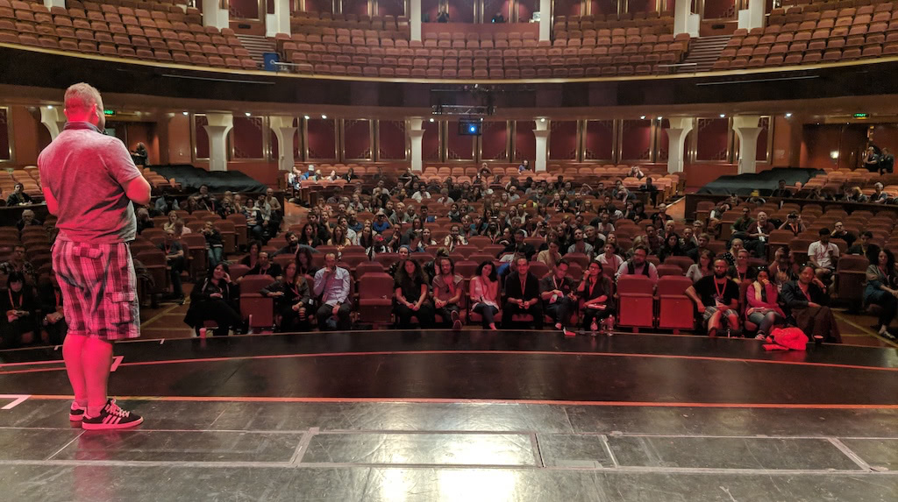

# Deliver a talk or workshop

{:width="1024" height="573"}

Once you got invited to speak, got your facts right and prepared for all
kind of technical failure you can think about delivering your talk or
workshop. This is where you need to make sure you do things really right
as data is one thing but data being delivered in an engaging manner is
so much more powerful.

> **Fact:** There are no bad students or a bad audience -- only bad workshops and talks. Your mood, dedication and enthusiasm do become those of the audience -- if you are not happy, they won\'t be happy. 

Public speaking is an art and there are a lot of tricks you can learn
from acting or other forms of performing, but in the end all it boils
down to is being prepared and happy to do what needs to be done. Someone
has to tell all these people about the cool things you want to talk
about -- and if you don\'t do it some sales person will. There are a few
things to think about when delivering your materials:

## Be yourself

You will find dozens of books and videos on how to be a great presenter
-- however **nothing makes you a better presenter than being who you
are**.

You should not have to play a role or dress up. If you believe in what
you do, you will be great. Your best asset is confidence. Confidence
does not come naturally but it will get easier the more you present.
Prepare your materials and expect everything to go wrong and there
won\'t be any bad surprises.

If things go wrong -- and they will -- take them in stride. Say flat out
when you made a mistake and get on with it. One of the main things to do
is to give the audience the impression that whilst you are an expert you
still are a human being, prone to error just like everybody else in the
audience is.

## Invite communication

All of what you do as an advocate is about communication. You are a
sender that brings a message to the audience but you are also a receiver
that brings the issues, concerns and ideas from the outside world back
to the company.

If you give a talk tell people that it is OK to ask questions. Make
space in your presentations for that. Stop after a complex part of the
talk and ask the audience if all of that was understandable or if you
should repeat some detail. Ask them questions and have small presents
for people who answer.

Tip: It is generally a good idea to ask the audience questions from time
to time. Ask them what they do (show of hands) and if they had
experience with the product already and so on. This will give you an
idea how to pace the rest of the talk but also makes people feel that
they participate and keeps them from nodding off.

## Prepare takeaways

People should have the chance to concentrate on what you are saying and
shouldn\'t feel that they have to jot things down to keep up.

Have a URL where they can download your information afterwards and show
this as one of the first slides. I've also found it worth-while to
create a 2D barcode, so people can take a photo instead of having to
type the information in. There is a practical upshot for you in this,
too. Most URL shorteners or 2D barcode generators also have statistics
attached to them. You not only make it easier for them to follow up, but
you can also prove the interest your talk stirred to your company.

Say upfront what you will cover and what they will get out of it. You
don't need to have a full agenda slide (although some -- very corporate
-- environments require those) but it is good to tell people upfront
what they are signing up for. Remember, the "what is in it for me" of
the audience is what you need to answer..

Making people guess makes them feel uneasy and that is not what people
should feel like when they listen to you

## Plan time for and own the questions and answers

Plan for time for a "Questions and Answers" session after your talk
(most conference organisers will do that anyways -- but be generous).
These sessions allow people to ask exactly what they need answered and
go back and have a go at solving their problems immediately.

One thing that is very important is that **you need to be in control of
the Q & A**. A lot of times you will have people who don't ask questions
but profile themselves instead. Deal with that accordingly -- and
swiftly. People will have real questions that need answering.

Tip: If you find a person in the audience that talks for a minute about
their skills before asking a question cut in. Ask the person for their
name and single them out as an expert. "Great, X here knows a lot about
issue XYZ, so during the break you could also ask her about issues
dealing with this. X, if you want to we can collect some of the
questions and work through them later together." That way you gave X a
chance to deliver their knowledge, made them feel like a million dollars
and another person has a chance to ask a real, burning question that can
be easily answered.

## Be honest and real

If you don't know an answer -- **do not speculate**.

Instead a great message to give is to ask the audience if someone knows.
Normally there are other speakers or "silent experts" in the audience
that can help you out. That way you show that you are open to learn, too
- and the stigma of the "arrogant speaker" is broken.

If there is no answer offer to investigate further and swap contact
details with the person who asked the question. There is no harm in not
knowing something. There is harm in lying though.

## Follow up communication

How you communicate after a presentation can often be more important
than how you came across on stage. Remember, giving talks is a means to
an end to get people to use your company's products and -- if you have a
developer program - participate in their creation. This means that you
should make sure you email everyone who gave you a business card (which
can become time consuming but is something you can do on a train).

> **Tip:** Make sure to post, upload recordings, photos and slides as soon as possible. This shows respect to those who came to see your talk, and invites those who missed it. Talk coverage posted weeks later is highly unlikely to be looked at. There is a lot happening to keep developers distracted. Act swiftly and you can be part of the attention spike generated by conferences.

Have contact options available after your talk (normally on the last
slide) -- email, twitter name and so on. The best plan is to have
dedicated communication channels for that and not your company mail or
IM name you use at work. For starters this allows you to be more
selective in answering but more importantly giving out company
communication channels to anyone can be a security risk.

