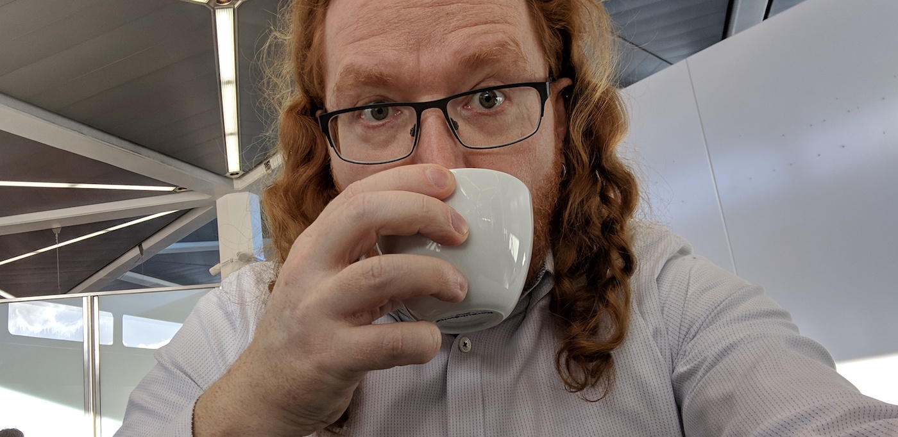

# Final Words

{:width="1400"
height="682"}

And that's about all I can think of right now. When I first published this handbook it filled a massive gap and I couldn't have hoped that helped jump-start the world that is Developer Relations right now.

I guess the main part was that the book started from experience. I was lucky to have had access to both the corporate world (working for Yahoo back then) and get the freedom to run my own blog and advocate my own personal brand. Well, luck was one part of it, but being daring enough to flat out demand a change was the other side of it. I came from a position of power. I was a lead engineer and the market just started kicking off again, and, having hired other engineers, I knew how much it costs to hire someone and - even more important - to have someone leave for the competition.

Being able to be your own voice has become quite common but back then was pretty much unheard of. "We pay your cheque, why don't you talk exclusively of our products?" was the mantra these days. I successfully managed to convince my company to become a "Developer Evangelist" and thought it may be a good idea to write down what I did to get there.

Now, some 15 years later, having spoken at times at 30 conferences a year, having recorded lots of podcasts, shows and training courses, I'm baffled as to how big this market has become and how many people work full-time in DevRel.

It's been one hell of a ride and I am still humbled by all the opportunities the change into DevRel brought me. May that be traveling the world and seeing new things, creating an excellent network of people to nudge when I need to get access to some company or monetary benefits from secondary incomes or living on expenses.

That said, it is also a draining job. You are always in the spotlight and anything you do can and will be turned to support or dispute some cause of people who envy you or try to become you. To a degree it feels like being a small celebrity and I got a lot of empathy for people always on the presentation platter.

I made a lot of friends on the way, found and supported some excellent talent and I am proud to see how they developed just after having a small conversation that was a "hey, I really think you can do this. If you need some help with the basics, I'm happy to show you…".

I also made some enemies and, without wanting to, hurt or offended people. This is hard to deal with and even more draining. But, it is something to carry and try to find the best way to deal with. After all, even as the most kick-arse Developer Advocate, you're also human.