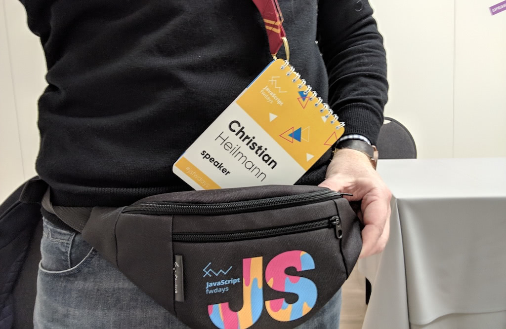

# Prepare for outreach

As a developer advocate a lot of your job is going out there and tell
the world about the things your company does (or technologies,
techniques and methodologies it uses). Your success in this is to a
large part relying on how the world sees you -- are you a tech guru or
somebody who just tries to sell their company or some product? **Your
integrity is your main power** -- you have to make very sure that it
stays intact. This means first and foremost that you need to prepare
properly before going out there.

## Get your facts right

You will be asked to talk about a certain new product. Make sure that
you are up-to-date on the matter before you go and speak about it. Do
not promise things that are not under your control. Talk to the product
team and ask them **in meticulous detail** what the product is about,
what works, what doesn\'t and so on. Be as skeptical as possible as this
is what the people you are about to talk to will be.

## Know the audience and their needs

Your communication should be targeted to the audience. People came to
listen to you or read your article with a personal agenda -- if you
fulfill that agenda you win. Know what people expect and need and you
can deliver. Otherwise you need to hope for the best -- and that is
never a good plan.

Going to conferences costs money. Going to free events where you speak
costs time. Make it worth while for the people who do either and try to
get something into your presentation that they can go back to their
company with to wow their bosses. That way they will be able to go to
more conferences and your other events.

> **Example:** A long time ago had to give a talk about [Yahoo
BOSS](http://developer.yahoo.com/boss) (now defunct) to a search engine
optimisation crowd. They loved that Yahoo\'s search index is open for
remixing but also were aware that in the country I gave the talk Yahoo
only had 5% of the search market. I worked around this by building
[Keywordfinder](http://keywordfinder.org), a tool using the Yahoo Search
Database to create keywords. Giving them a cool tool to get keywords
related to certain showed them how versatile BOSS is (well, was...).

## Have expert backup

You cannot be the expert in everything. In the best case, when giving a
presentation try to have an expert at hand to answer tricky questions
for you. If there is no expert available at the time note down the
question and follow it up after consultation. Do not promise to come
back to someone and then forget to do so -- that'll make you look like
you needed a fast way out! There are far too many speakers out there who
play the "I\'ll get back to you" game.

Under no circumstances try to wing it and promise things you are not
sure the product team will be able to deliver. You are here to promote
what can be used, not put pressure on your colleagues by promising the
world the moon on a stick.

## Choose the right medium

Your communication should be in the right format for the intended
audience. This can range from slides, over videos and audio to live
coding exercises, online step-by-step examples or streams.

> **Tip:** My rule of thumb is -- the more technical the audience, the less
you should use powerpoint or keynote. Show how you can code with the
product, not how shiny it is or what its workflow is.

## Plan for failure

Things will go wrong and you need to be prepared. In the case of a
presentation do this:

* **Have your slides online somewhere** -- in case your local copy dies.
* **Have a memory stick with your data on it**, in case you need to use a computer that is hard-wired into the AV system.
* **Prepare to not have your slides available** and still be able to do a Q&A session.
* **Don\'t expect any technology to be available** -- bring your own connectors, power cables, network cables…
* **Don\'t expect to be able to go online** - or turn on a hotspot on your mobile as backup if you really need to be.
* **Aim for resolution independence** and expect the worst possible colour setting and very low contrast. A good idea is to always leave plenty of border around your slides as many projectors cut content off.

> **Example:** Once I gave a keynote at a conference about Artificial
Intelligence and my overall message was that whilst machines are faster
and more efficient than we are they are also not infallible and augment
the mistakes we made. This was a conference with a complex stage setup
that needed me to send them my slides in advance and be played from
their computer. Promptly the presentation machine crashed and my slides
somehow got out of order. After the first 5 there was darkness and
nothing worked any more. So I took on the stage and used the failure of
the stage setup as a hook to tell the rest of the story. Halfway through
my story the slides came back up starting at the wrong one which gave me
a chance to talk about what machine learning can do wrong with data that
isn't in the correct format. The tech issues could have been the end of
the keynote, but by rolling with the punches I got the audience on my
side and brought the message home.
