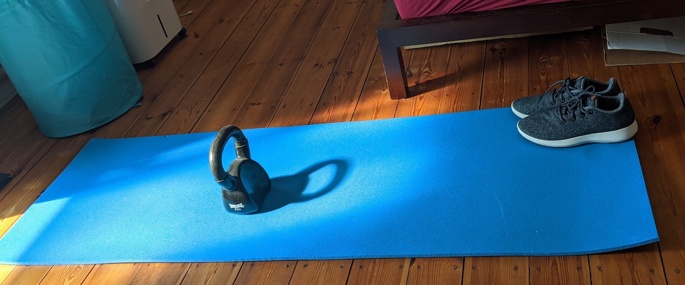

# Prepare great slide decks for presentations

{:height="626" width="1500"}

**Slides are a tricky thing to get right**. The main problem with them
is that as a developer advocate you predominantly have a technical
audience and slide decks are anathema to us. The term \"death by
powerpoint\" is much more than a Dilbert cartoon. Sadly enough a lot of
our day to day life in offices consists of sitting in a room trying to
look alert whilst slowly dying inside as some old-school presenter shows
us just how many bullet points you can cram into one slide.

Again, as with the other chapters a lot of what you will read here will
vary with your experience and environment but I found the things I am
sharing here helpful in my quest to bring technical goodness to the
starving masses of under-appreciated developers. Furthermore, I got a
lot of good feedback and high viewing figures on slide sharing platforms
for my slides which can be an indicator that I am doing the right thing.

## Know your stuff

The biggest mistake that presenters do is to rely on their slides as
their main source of information. If you don\'t know the subject matter, 
are not excited by it or you haven\'t done much work with it you
will give a bad presentation. Nothing makes you a better presenter than
confidence in the subject and hands-on knowledge.

You will sooner or later be asked to stick to company approved material
or \"re-use this great deck XYZ has done\". Try to avoid this as much as
you can. A presentation is you telling people about what you think is
important that they hear about. If you have no clue what the issues with
the product are or if you don\'t really care about it you will get into
trouble. Technical audiences are great at spotting what you don\'t know
and will make that the first question in the Q&A session.

There is nothing more painful than a presenter turning to slides and
reading out what is standing there. You don\'t want to become the people
that bored you to death before. Also, as mentioned in the \"Deliver a
talk or workshop\" chapter, audiovisual equipment hates presenters and
your slides might not be available for you for one reason or another. If
you know the subject matter and you are excited to talk about it you
will give a memorable talk regardless.

Furthermore, this is you presenting. If the slides are not your style or
your language you will appear stilted and you have to remember what the
deck says. Public speaking is about giving information in an
entertaining fashion -- not acting. You should not have to play the role
of \"corporate speaker\" but instead be you. Only then you will be
believable and effective. 

## Start with the content -- not the slides!

The first mistake people make is to see the slides as their
presentation. The slide deck is an aid to make your presentation easier
to take in and more enjoyable for the audience. For you as a speaker
they are the narration thread -- a reminder of what you want to cover in
your talk. A good speaker can keep a room of people interested without
any slides whatsoever. A good slide deck, however, gives people
memorable moments and information they might miss if all they did was 
listen to you.

## Start with a highly portable Format - Text

When I write a new slide deck I start with a text editor. I write the
story of my presentation and I follow the same rules as for writing
online articles. That way I make sure of a few things:

* **I know the content and the extent of what I want to cover** -- which also allows me to keep to the time limit when presenting.
* **I have the information in a highly portable format for people to read afterwards** -- by converting it to HTML later on or blogging these notes.
* **I already know all the links that I want to show** and can create easy-to-find versions of them.
* **I don\'t get carried away with visuals and effects** -- which is a big danger when you play with good presentation software.

> **Tip:** Having these notes makes sure that you will have something for
people to read after the presentation. You can mention this before your
presentation and give them the URL. This relaxes audiences immensely as
the first question at every conference I get is whether the slides will
be available or not.

## Quick Presentation creation tip: unpacking bullets

Bullet points in posts and educational texts are great, as they chunk
content into digestible bits and give a structure that flowing text
might not give. But, as a slide in your talk, they are the most boring,
lazy, and actually inefficient way to bring your message across.

Melissa Marshall explained this quite nicely in the "[Talk nerdy to
me](http:/www.ted.com/talks/melissa_marshall_talk_nerdy_to_me.html)"
TED talk: "bullets are made to kill and bullet lists kill audiences".
This is especially true when you show all the bullets at once with each
having a long sentence following it. This will make the audience read
ahead, and stop focusing on you as the presenter.

Bullet lists are a great way to pack a lot of information into a short
amount of text and space. They are also a great way to structure your
thoughts, information and narrative and be able to re-arrange
them.

That is why I found that starting your presentation materials with a
bullet point list can be incredibly useful. I tested this theory by
making it a training course task and seeing the attendees create good
presentations in a very short time. I call the method "unpacking
bullets" and here is how it works:

* Write the complete outline of what you want to cover in your talk as a bullet list
* Re-arrange as needed
* Take each bullet point and think how to best bring it across. Does it need an image? An illustration? Some demo code? A screencast? A mixture of all of them?
* Take each bullet point and make it a slide, or group of slides with the materials you thought necessary
* Add a cover slide and a thank you slide with resource links and you have a presentation

In essence, you create a to-do list for your slides, you define the
[narrative structure](https://en.wikipedia.org/wiki/Narrative_structure)
of your presentation upfront instead of collecting a lot of material and
arrange it in a second step. That way you ensure that you show 
the right amount of information rather than getting over-excited and
showing lots in the hope that at least some of it sticks with the
audience. Give it a try -- it really works for me.

## Pick a presentation tool that helps you present

Once you know the content, you can start putting together your slide
deck.

Choose whatever presentation tool that makes you happy and allows you to put your slides together. Picking the tool you want to use should be based on the needs of a good presentations:

* **Display your slides on the screen regardless of resolution** -- I've encountered every resolution imaginable and often I got a "can you do a 4:3 instead of 16:9" twenty minutes before the presentation.
* **Use, crop and resize images easily** -- you will use a lot of imagery and it is never in the right format.
* **Allow you to position elements freely on the screen** -- sometimes you need things next to another, sometimes you need to overlay a URL over an image.
* **Support remote controls** -- as you **should** walk around during your presentation you should be able to use a remote control instead of hitting the space bar.
* **Have a way to transition smoothly from one slide to another** -- this is a subconscious thing but it makes your slide presentation so much more enjoyable.
* **Be full-screen** -- browser bars or copyright lines and headers are distracting the viewers.
* **Have a way to blend things in one at a time** -- this helps your narration and you don\'t need to repeat content in several slides.