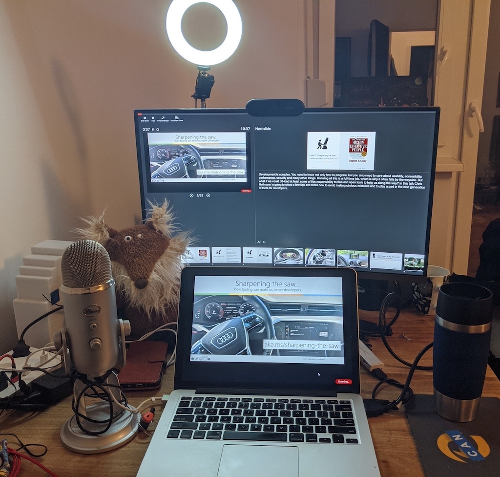
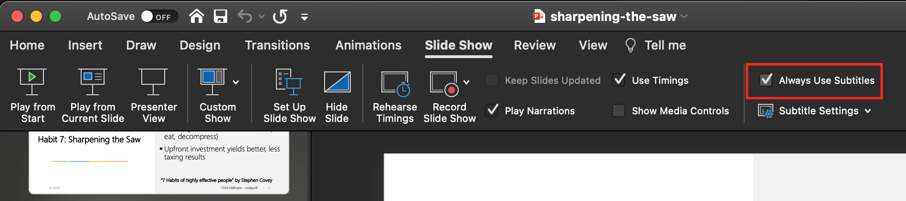

# Recording your own talks

Quite a few virtual conferences have had bad experiences with live talks
and will ask you to do a recording of your session instead and send them
the video. This may sound daunting at first, but I was pleasantly
surprised how many options you have to record and edit your own videos.
Almost every slide software comes with a recording option.

What you use is up to you and you may look around and try a few things
out. I was, for example, pleasantly surprised to find that both
Powerpoint and Keynote come with a recording option. You can add a video
recording and a voiceover to each slide, right in the program itself.
There are also browser extensions that allow you to record anything on
the screen.

There are a few benefits to recording your talk and sending it to a
conference:

* You can edit problems and record the talk bit by bit rather than presenting in one go
* You can re-record as often as you like to make sure you get it to the right length
* During the conference you can concentrate on the live chat and see what people say -- also a good idea to keep a record of that
* When it comes to the live Q&A that follows almost every virtual talk you are refreshed and ready to tackle the questions without being frustrated by possible technical hick-ups earlier
* As you define the quality and accessibility of the video you can do a really good job without any rush.

Of course, not all is perfect and rosy though.

Presenting to your own camera can feel much tougher than presenting to
an audience. Audiences are scary, too, but at least you get some
feedback. Telling a joke to a camera in your own room feels strange and
much more like acting than presenting. That shouldn't dampen your
excitement though and putting some extra effort in to appear
enthusiastic and as if you are talking to an audience leads to great
videos. As silly as it may sound, but I had great results by talking to
the fox puppet on my desk. Don't worry, he doesn't answer.

{:width="1024"
height="976"}

I tend to create a lot of versions of my video and criticise myself much
more harshly than when I am on stage. On stage you have the excuse of a
stressful surrounding and some "uhm" and "errs" or forgetting a detail
is forgivable. It feels less so when you record and deliver a video.
But, once again, a bit of human failure is fine to leave in and will
make you more likeable and approachable. We don't need perfect videos
for everything -- we need some that are exciting because what the person
presents appears repeatable and relatable.

When it comes to watching movies, I love to also watch the making
of/behind the scenes and especially the blooper reels. It shows me that
humans made the thing I enjoyed and that they had to struggle with all
the same issues we also struggle with.

Often I just record myself presenting the slides and going through some
demos and don't do much editing because of that reason. However, I've
done this for a long time and feel comfortable in not being perfect. If
you just start out, you might want to give it a bit more effort.

> **Tip:** It is important to remember that any video you publish is a
potential way in for more work. Many conference organisers want to see
at least one good video of speakers before inviting them. This means
that any video you got out there is a calling card. That's why it is
also important to keep your contact details in your slides.

Here are a few things that helped me record talks that are on time and
high quality.

## Check your setup and your surroundings

Much like when you give a live talk over the internet, it is important
to check your setup and surroundings. Before you record yourself or
stream make sure that nothing behind you could be distracting, confusing
or -- in the worst case -- offending. While a lot of recording and
screencasting software has virtual backgrounds or blur options it is
still a good call to get everything out of the way. To avoid annoying
distractions make sure you turn off any notifications, automatic
software updates and make sure you have some uninterrupted time to
record your talk. I tend to set up an own OS and browser profile for
recordings to make that easier. Try to avoid having to deal with any outside noise and
keep the door closed with a sign outside that this is a recording in
session and art in the making.

## Record different parts of the talk separately

The fun thing about recording your talk is that unless you have
animations on your slides, you don't really need to go through the deck
while you record your video. You can add each part of the talk as a
still image and show it in the video as long as you need. You can
concentrate on telling your story and letting your facial expressions
and hand movements show your excitement.

You can also show and hide your video if you don't want to be in the way
of the screen and you can record the audio of your talk separately. Some
conference organisers want that anyway as they need to splice the slides
and the video into their template.

As explained earlier in this book, this is a great opportunity to show
tech demos without long loading pauses or things becoming inactive
because your computer is also busy recording video and audio. Creating
screencasts of tech demos and narrating them afterwards is a much more
reliable way to get a lot of information into a short amount of time.

## Remember that you need to share the screen with your slides

As you are not physically next to your slides you will have to find a
space on the screen to place your video. This often means you need to
resize the slides. Whilst you may have a huge screen to record and it
feels there is enough space, remember that people might watch the
conference on older computers or even mobile devices. It makes sense to
err on the side of caution when it comes to how much you can show on
screen and how big your font settings should be. I tend to create my
slides with that in mind and keep one rectangle on screen free for
my face to appear in. You can even make that part of the design.

## Use accessibility features to add extra video value

Many slide systems create automatic captions of what you say. Not every
conference has the same feature or the place where they store the videos
may not have it either. That's why it is a nice to have to turn on
captioning on your system when you record your talk. In Powerpoint, for
example, this is part of the Slide Show menu and all you need to do is
tick the "always use subtitles" feature.

{:width="1898"
height="422"}

## Record in the highest possible quality

That should be a given, but it is important to record in the highest
possible quality. Sure, this results in huge files, but it gives you an
opportunity to edit and fix things without awkward re-recordings and
edits. Every video editing tool I know has an export setting that allows
you to create a "good enough" version that is not multiple gigabytes,
but you shouldn't have that as the material you work with when it comes
to editing your videos. Again, this also means using a good microphone
and -- if possible -- an external camera.

## Keep originals and make it easy to get your video

Most video recording tools will have an own format that is huge. It is
tempting to delete those files once you're happy with your video but
I've often had conference organisers come back to me with some last
minute edits and changes and doing those in an already exported video is
much harder. External hard drives aren't that expensive and I used a few
Cyber Mondays to stock up on some that exclusively hold the original
files of my recordings.

Once you are done with your recording and exported to an OK file size
you need to get it to the organiser of the conference. Often these will
have some place for you to upload them, but I found the easiest way to
share them to be some file sharing service. Box, Dropbox, Microsoft
OneDrive, Google Drive, AWS Storage, whatever you want to use -- it is a
good idea to invest in one of those as you don't want your material to
be hosted on some dodgy "free" service and go away without you having
any say in backups.