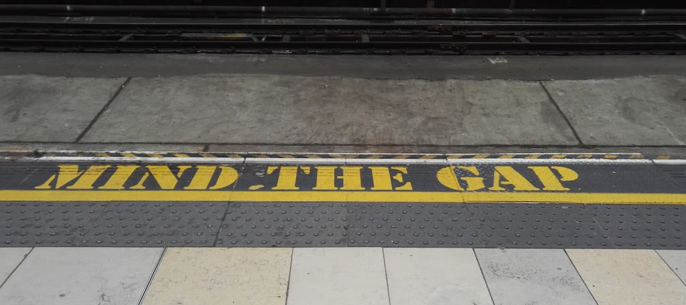

# Delivering presentations tips: timekeeping and more

{:width="1024" height="456"}

Talks and presentations are a great tool. They allow you to bring to an
audience what excites you in an engaging and personal manner. An
audience that gives you immediate feedback -- a lot of it in the form of
body language and reactions. To me, It is one of the most enjoyable and
interactive parts of being a developer advocate.

> **Fact:** The start of any great presentation is excitement about the subject
matter. If you don\'t have that you might as well not be out there.

We already covered that a few times in this handbook. In this chapter I
want to cover a different problem of presenting. Keeping time and -- more
importantly -- keeping the audience interested.

The following information revolves around presentations at conferences.
Presentations that are your slot in the program and stand alone. Not
those introducing a workshop or during a company meeting. Many of the
things I will cover here are applicable to those, too, but there are
different nuances to take into consideration.

## How will I fit all of this in X minutes?

As someone who starts out presenting, you will freak out about time
keeping -- a lot. That\'s natural and also OK. We all do that.
People who just started presenting fall into two categories. Those who
rehearse every second of the talk and get derailed by disruptions and
those that appear far too fast in their delivery.

> **Fact:** We tend to run up stairs rather than down them. The reason is that
stressful and tiring tasks appear easier when you get through them
quicker.

That\'s also the reason why the delivery of your talk will
always be faster than the rehearsal or how you planned it. The
adrenaline rush you get from presenting on stage does that to you.
That\'s OK. It makes you human, approachable and brings the audience to
your side. You did the thing we all are scared of -- presenting to a
group -- and you are still scared of it. This makes you an honest,
technical presenter -- not a slick and perfect actor or politician.

> **Warning:** When you get more into the routine of presenting, this automatic
speeding up can become dangerous. The excitement doesn\'t wane -- all you
do is getting used to being fast.

That\'s why over time, your decks become larger and you are tempted
to add more and more to your talks. You got time, so you might as well
use that time, right? People should get something for their money and more
is always better, right? Not always…

## Less is more

**Don\'t fall into that trap**. A great talk makes only a few points all
revolving around one central theme. That\'s why conferences focused on
presenting have short talks. The sixteen to eighteen minutes limit TED
imposes on talks is not a trick to get more content. It is a great limit
as this is the time an audience is alert and able to take in things.
It also forces the presenters to think about their talks more: you have a
limited time to make your point. This means you will remove as much
cruft and fluff as you can. And you pick the more punchy and juicy
bits of information.

This is something to remember: **start with a single point you want to
make**. This doesn\'t need to be a sound bite (although these are
important). It can be many things:

* It could be an insight.
* It could be a result of your research.
* It could be a \"here\'s the current state of thing X\".
* It could be \"here\'s what\'s new in product X and how we build this functionality\".

Start with your point and then add the rest around it. Much like a good
story has a build-up, a climax and an aftermath, so should your
presentations. In essence, your focus should be
**what do I want people to remember of my talk?**
This means you need to try to get into the heads of the audience a bit.

You know what you are talking about. Try to remember what was the main
\"A-hah!\" moment that got you to there. This is your starting point.
There is a reason why you are giving a presentation. The story you want
to tell about the topic of your talk is that reason. Not the topic
itself. You sell the topic -- you don\'t have to own all the information.
This is important. There are a lot of presenters out there that tell you
all the steps to take to achieve a goal. But you'll remember those that
inspired you to learn more about the subject in your own way.

## Your talk is only extremely important to you

There are a few things we need to consider when we talk about technical
presentations to audiences at conferences:

* **Your talk is one of many** -- if every presenter dazzles the audience with lots of live coding, great tools that make \"everything as easy as pressing a button\" and deep truths like \"methodology X is outdated, here is the new -- if experimental -- thing that will save us\" people are very quickly overwhelmed. It is refreshing to see a talk that makes one point well and doesn\'t look padded to appear more than it is. You can stand out by focusing on one thing.
* **Your talk is recorded and distributed** -- there is a lot of research telling us how long educational videos should be and the general consensus is that shorter is better. People use browser-add-ons to watch videos faster than they are to save time. Nobody wants to spend a whole hour just to learn about some new product features.
* **People will not remember the whole talk** -- you have to use the time you have to plant seeds. You want to have a few things people remember about your talk and make them come back to it or tell people about it.
* **People don\'t need you for information** -- they need you for reflection. They need you to learn how to apply something or insight using various resources. Nobody needs you to tell them the obvious or things they could look up in a few seconds online.

Your job as a presenter is to make a topic interesting for people to try
it out themselves. You open the door, you lead the way, and then they
can spread out and find their own way around.

This is the true art of presenting. Stage time isn\'t show and tell
time. This is what video trainings, workshops, tutorials or one on one
trainings are about. Stage time at technical events is \"here is why
this is something worth your time looking into\". Or \"here is the state
of research -- help us\" time. Not \"I know and I am so excited I will
show you everything I found\" time.

This can be tough to avoid as it is fun to show off on stage. It feels
good to share what you had to do to get somewhere. It is great to show
how effective using a certain tool or way of working makes you.

> **Warning:** It is important to remember that people are not you, and everybody has a
different way of learning and working. Showing off what works for you
and how it makes you better can come across as condescending or
arrogant. Remember that the audience most likely know their stuff, too.
And they want to show off that they do. That\'s why you will get
aggressive feedback on social media during and after your talk when you
came across as too \"in your face\" with your product or your technical
knowledge.

## Map out more information

The simplest way to keep on time and use the time you have to bring
across the memorable messages is to delegate the information. Instead of
explaining everything yourself, you point to resources people can look
up in their free time. You can reference a few things this way:

* **Comparison/research sites on the web showing the current state of a certain technology**. These are great as it means your talk stays current. You introduce the audience to a resource to see the current state of affairs should they watch your talk recording later. There will always be a delay between your talk and the release as many conferences take a long time to edit and publish the videos. Don\'t show a current state, instead point to the ongoing journey.
* **In-depth talks that cover the same topic you offer as a solution**. Say you give a talk about offline applications. You could go into detail about all the browser differences and the state of service workers. Or you could point to a deep-dive talk on the subject matter and explain why this technology is important and what problem it solves. This also shows you as someone who cares about other presenters and conferences. It shows you care about what you do and it gives the other presenters credit. It shows you are in the know and ready to teach and learn instead of just telling people what you know.
* **Test suites** -- instead of you telling people that something works, show them where they can test it themselves. This avoids people questioning you. All you do is share the results you found and what you make of them. Furthermore, you invite them to to do the same and find their own results to compare with yours. This makes the audience as cool as you, but you're still a bit cooler as you were the person they got that resource from. If they, for example, show their boss how slow their web site is and how to fix it, they\'ll remember you as the one who introduced them to the tool they impressed their boss with.
* **Interactive examples and fork-able resources** -- let them play and extend what you do. Put your code on JSBin, JSFiddle, CodePen or whatever other resources out there. Point to a GitHub repo. Make it obvious where to find your work and that you want people to use it for. Also ask them to give you feedback. Reusability and availability of code is important. Nobody wants to follow a recording of some live coding and trying to read the tiny code in a video.
* **Specifications and official standard discussion lists**. It is one thing to believe you as you are a speaker. It is a whole different game to know that something you talk about had a lot of expert eyeballs and got agreed on.
* **Collections of your resources**. Provide a link-list of the resources you talk about in your presentation and offer that as the one place to find it all. This avoids people having to note down what you talk about whilst you do it. It also allows you to use a short-url and track how many people looked up what you covered. This is a good metric to show to your managers.

One issue far too many people worry about is not being technical enough.
We all hate sales pitches -- there's no doubt about it. A presentation as
a format has a lot of teaching benefits in comparison to coding
exercises. That's why you shouldn't feel bad for using a slide deck
instead of opening the Terminal as the tool of your presentation. Which
brings me to the most likely thing to eat into your time budget: code
exercises and live demos.

## Live coding?

I've had many discussions about this with other people doing developer
outreach. We see live coding as the most amazing level of awesomeness as
a technical presenter. It shows that you are still a coder. It shows you
walk the walk and not only talk the talk. It means that everybody can
repeat what you showed.

Except, it doesn't. Don't get me wrong, I've seen amazing live coding
presentations. And they are always a big success with the audience. Some
presenters manage to make code a performance and keep it entertaining
and exciting. Those are exceptional people though, or the talk and the
live code has been extremely well prepared.

When asking the same excited audience members a few hours later what the
code was about or how the presenter solved a certain problem you get a
different picture. Live coding is exciting, but it also assumes that the
people in the audience work like you and use the same tools you do. Many
a time I've seen audience reactions getting off-track. People talked on
Twitter about the Terminal setup or the code editor the presenter used
rather than listening and reflecting on the topic of the talk. By coding
on stage, you allow people to get distracted by their pet setups and
ways to work and to show those off. It can be a major distraction. Or it
can even mean that people don\'t listen to you at all -- after all you
don\'t use their environment.

Live coding has a lot of unknowns that can derail your talk and eat into
your time allotment. A lot of things can and will go wrong:

* **You will be offline** -- don't believe anything conference organisers or venue owners tell you. As soon as you hit the stage, gremlins will get into the wiring and you will not be able to access online resources. This will also not be a binary state. Everything will look great right up to the point when it is needed. Then there will be a spinner and there will be nothing you can do about it except for re-starting the machine.
* **When speaking and writing you will add typos** -- that's just a natural thing to do. It is charming when you admit and fix it immediately or when someone in the audience discovers your problem before you try it out. But -- it costs time.
* **You will forget obvious things** -- like your login details. Many a time I saw presenters trying to connect to a system and failed with three logins. One time I saw a speaker not realising he is in the name and not the password field and typed his password in for 2000 people to see. Good luck fixing that.
* **Your code will be harder to write or not readable**. You have to bump up the font size a lot for people to see what you do and that means you have fewer characters to play with on one line. Often the resolution of a projector is not your standard one. This means that the setup of your editor now has to fit in a much smaller space and you won't have all the menus and toolbars.
* **You can easily show things you don't want to**. Autocomplete on fields, browser history showing up when typing into the URL bar, all kind of things can become annoying or even straight up embarrassing. Many developers I know create a brand new profile on their machine for presenting to avoid this.
* **Debugging and problem solving costs time**. When something goes wrong on stage, you need to admit it and move on. When you showed 10 minutes of code and the result doesn't work, you can not do that. That's when you start mumbling and concentrate on the code. Or you get lots of feedback from the audience in various states of helpfulness. In any case, it broke the flow of your presentation and time's ticking away. You lost control over your talk. And that\'s the one thing to avoid.

A lot of live coding is the "here, anyone can do this in one minute"
pitch, which can come across as tiring. As developers, we get promised
things that make our lives easier all the time. We also keep seeing them
fail. And we've seen a lot of "one minute demos" of things we never,
ever had to in our jobs afterwards.

> **Warning:** If it feels too simple to do, it
either isn't worth doing or it is insulting to our jobs as developers.
We're experts, and expert tools should make us build higher quality
products -- not make us redundant.

That said, if you are firm in what you do and the conference is a
technical one where people expect things to break as they are
experimental -- go wild. I'm not here to stop you from being as creative
as you can be in your own, personal way.

Consider doing screencasts of code and/or product demos and talk over
them. The reason is that talks should be repeatable and their content
reusable. Using a screencast, you can speed up the loading or
compilation parts of the video and you know the length of the exercise.
You can concentrate on coding and on stage you can concentrate on giving
a live commentary. Doing both is hard because typing something different
than you say is not a natural thing to do.

## Avoid questions

One of the worst things to do during a presentation is to allow for
questions. I know, earlier in the book I said that's a good thing. But
that wasn't exclusively about conference presentations. While offering
the option to ask questions may seem like a great service to the
audience and makes things appear more interactive, there is not much
benefit to it. In a presentation that is part of a workshop to introduce
a part of the workshop, that's fine. At a conference, where you're on
stage and you have an allotted amount of time, it is nothing but
distracting:

* **You will have to listen to the question, understand it and then repeat it**. This is for the audience, but even more importantly, for the recording. On the recording you will look like a lost person trying to squint to see who asks and to hear and understand what the question is. Not a good look and not a great use of the time of the people watching your video later on.
* **The questions are either about things you will cover later, or about other topics, not directly connected with the one you are talking about**. The former makes you look smug when you say \"ah, that is coming later\". It also makes the time used for posing, understanding and repeating the question a total waste. It makes the one asking the question feel like he wasted everybody\'s time. The latter means the question disrupts your story and narration arc and distracts the audience. You lost them, and that\'s the main thing to avoid.
* **It is too cocky a thing to do**. Sure, allowing for questions during your talk shows that you are not afraid. It shows that you know everything there is to know about this topic. It also shows that you don\'t care much for your talk or that you haven\'t got a coherent story to tell. You already admit that your timing is not important and that you\'d rather have a discussion with people. Why not just offer an open Q&A instead of a talk then?

Make it obvious that there will be time for questions after the talk.
Tell people where to find you during the conference and how to contact
you. Re-assure people that your talk will have a lot of information to
come so that there is a good chance their questions will get answered.
In essence, show people that this is a planned talk with a fixed length
and they will be much more receptive and prick up their ears.

## Things to cut

There are a few things we consider good style to have in slide decks,
but are on closer inspection not as useful. They can work for you, but I
found cutting them had no ill effects in my talks:

* **Agenda slides** -- this tells the audience when to sleep and when to stay awake. You can say what you will cover in one sentence at the beginning of the talk -- no need to keep reminding people where you are at the moment. This feels like a crutch for the presenter and it gives the impression that you are not telling a story but follow an instruction sheet.
* **Corporate information slides** -- \"I work for X, a company that does...\" is not what people came for. Unless your talk is about your company avoid this at all cost. That includes massive corporate branding of your decks. Unless there is a legal reason for that, cut that out. This is your time and how you fare makes people excited about your company. The problem with branding is that people have a preconception about brands. Don\'t let that be in the way of you becoming one.
* **Long-winded introduction slides about yourself**. That\'s what the bio on the conference materials is for, and -- guess what? Nobody reads those either.
* **Current jokes and memes**. While it is cool to have those right now, they can look dated and in many ways even more contrived when people come back to your talk later. Even worse, what could be funny in the moment can become offensive in the nearer future when a certain meme or celebrity gets adopted by people you don't want to be seen associating with.

## Talk fillers

Once you are happy with your talk and you realise you have nothing to
remove, what can you put in to add value and fill up the rest of the
time? There are a few things that can be important:

* **Tell people where to find the slides of your talk**. Hardly anyone ever looks at them but everybody wants them. This is always the first question in Q&A.
* **Have a slide where to meet you and how to contact you**. Tell people why you use a certain channel and for what. Tell them how likely and fast you are to respond where.
* **Have a slide about colleagues or people you work with in other companies** that are experts on that topic. If you\'re busy, people can contact these.
* **Show where you are publishing and where your team is publishing things**. You don\'t want to be the only source of truth.
* **Show resources that cover the topic you talked about that need participation**. Mailing lists, repositories, unit test libraries and so on. In other words, show where the audience can become part of this in a simple and helpful manner.
* **Show resources you read to learn about that topic**. Sharing your sources is something people appreciate and it gives these resources a boost.

## Planning Your Talk Summary

Plan your talk around a central theme and single learning point you want
to get across. Add more around it to tell a story. That way you can
still take things out should you get less time to speak as your
predecessor used up too much. Your time is limited, the audience is not
listening to every word you say. Make it worth your and their while by
having great things to say, materials that help keeping the pace and
avoid those that can cost a lot of time when they go wrong. Murphy is
watching you. Cheat him by being prepared and offering longer Q&A if you
need to.