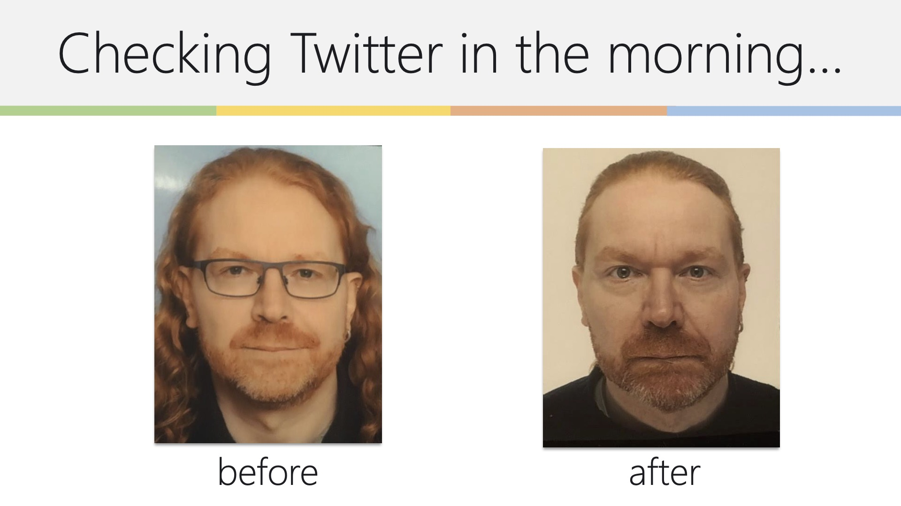

# Know and use the (social) web

{:width="1364" height="767}

The web is your biggest playground as a developer advocate. It is a
world-wide, 24-7 information and communication channel and allows you to
get your message out.

By understanding and using the social web you will also find that other
people become relays for your great stories and that people might even
translate and publish in their own markets for you.

Social media had a meteoric rise in the last few years and took over a
lot of our time. A lot of money is being made by giving "social media
consulting" and "growth hacking" trainings and it is tempting to use the
same tricks that are reminiscent of "search engine optimisation" back in
the days. While the tricks taught in most of these will give you instant
success, this success will also fizz out faster than you can say "hype".

> **Warning:** Be aware of that -- your job is to use the web as a communication and
distribution channel -- not to make a mint in a week selling snake oil.
This would kill your reputation and as stated before your reputation,
integrity and honesty is what makes you a developer advocate. Losing
these will make it almost impossible for you to get listened to in the
future which renders you useless for your company and gives the general
idea of developer advocacy a bad name.

## Find great web content

As the web is where you want to publish, you also need to be interested
in it and find great things to tell people about. As explained in the
[Brand and Competition chapter](working-with-your-competition) of this handbook you cannot exclusively
talk about your products.

> **Tip:** the most time-efficient way to find content is to use a news
reader. With the demise of Google Reader I switched to Feedly and whilst
RSS as a news source seems to be an anachronism I still find a lot of
good information with it without the noise of other, more in-the-moment
products.

Other great resources are topical mailing lists and news aggregation
sites. Don\'t just find things -- make sure that what you find was
ratified by a human or humans you trust. Then you can safely
re-distribute it.

## Redistribute web content

Once you found great content -- re-distribute it. The reason is that you
have a different network than other people have and you should never
assume that people already know about the things you find. It also makes
sense to add more information to a link and tell people what it is about
or why it is great. This causes resources you promote to see you as a
multiplier and I often got access to companies and products that way
much better than a cold-call or an email to contact@ would have.

You can re-distribute web content in several ways:
* You can **blog** about it.
* You can **add it to social bookmarking sites** and add a good description and tags.
* You can **use it in a presentation**.
* You can **quote it in a mailing list or forum** to add more relevance to your post or mail.
* You can **tweet** about it.
* You can mention it in one of your videos or tutorials. For example you can show an implementation and point to a resource for in-depth information on one of the things you use as a step.

In any case, the most important thing is that you **attribute the content to the original creator** by name and resource. The reason is
simple: publishers track what people do with their content, so if you
blog about a subject, your blog will show up on their radar. The same
works for re-tweeting. In other words, you get known to them which could
be the start of an interesting two-way communication.

## Be known on the web

If your job is to bring interesting news and explanations about web
products to the web then it should be pretty obvious that you should not
be a stranger on the web either.

Sign up to mailing lists, post on forums, use Twitter, poke around all
kind of channels, leave comments on interesting news articles of tech
magazines and online magazines -- simply don\'t be shy to give your point
of view or real advice whenever you can. Sometimes this can be as simple
as saying what you like about a certain piece of information. We don't
give enough praise online, and it does feel good to get it.

Be aware of new and upcoming networks and social apps and sign up for
them as soon as you get the chance.

Being visible is especially important when you work for a large company.
Tech news portals love to bring news about big companies -- especially
bad news. It is also stunning how many times these news items contain
distorted if not outright false information.

As the marketing and PR departments of your company are most likely not
aware of these tech publications and hardly ever would step in to
rectify the mistakes this is a good chance for you to act. Stick to
technical, real information and show proof of your points. Some comments will 
side with the misinformation as it is just cool to
"stick it to the man" and fight large organisations but the lesser vocal
majority will at least get the real story straight from the horses\'
mouth. **Be absolutely sure about your facts if you do that though!**

> **Fact:** When you work for a large company people will automatically
try to disagree with you and try to "out" you as a corporate drone. This
always annoyed me to no end. If what we call best practices and
standards are not used by large companies they\'ll never spread across
the whole market - so fighting the big players is actually hurting the
cause. I call this prison tactics: a new inmate will make sure to beat
up the largest and toughest guy to make sure the others leave him in
peace. Maybe successful there but annoying and pointless in the IT
business.

Social media experts and entrepreneurs will tell you that it is terribly
important to use your real name and have a domain with your real name
and make it all very personal indeed. I am living proof that that does
not necessarily apply if your drive is to educate and help people rather
than building a personal brand and make a living by giving the same
workshop over and over again. Sometimes a handle that is more technical
or geeky actually gives you more credibility and makes people listen
more -- especially when you used it for years in other circles and stick
to one.

## Use powerful social web sites and products

The social web is evolving almost monthly and especially right now there
are a lot of companies being shut down or others emerging in weekly
cycles. This is OK -- it is an evolution after all. For you as an
developer advocate this can be an opportunity:

* **Write about new social media products** -- have a play with them, jot down your first impression.
* **Be on the lookout of new products** -- if you sign up quickly you normally get invite codes (a very common practice in launches) -- and having those as one of the first and saying so on Twitter is way cool.

In addition to the new kids on the block of the media space, it is
important for you to be aware of great resources that are already
established, have a network of specialists and allow you to easily store
and access content:

* [Flickr](http://flickr.com) used to be a leading photo sharing community that allows you to store photos and screenshots. Flickr is still a great resource for Creative Commons licensed photos for your presentation. It used to be a massive community and a great way to interact with people. It is still around and has high-quality content but for quick fire and forget image posting it's been replaced by the likes of Instagram and imgur quite some time ago.
* [YouTube](http://youtube.com) is the \#1 video sharing web site in the world, run by Google. It is very easy to store video on YouTube and embed the videos back into your blog or web sites. Users can comment and tag. The support for annotations and captions helps to create accessible content and allows you to add extra information to video content. You can have your own channel and have drafts and timed video releases. You can also go live on YouTube and have your own show. Quite a few people make a living on YouTube these days, so it might be tough to stand out.
* [Vimeo](http://vimeo.com) is another video sharing site, which does the same as YouTube but has higher quality content. I found that it works better for higher quality and longer media.
* [Archive.org](http://archive.org) is the Internet Archive which allows you to easily store videos, audio and pictures that you want to release to the public.
* [GitHub](http://github.com) is a social code sharing network. Git is a version control system and GitHub allows you to store code there, have a Wiki to explain the information and make it easy for other developers to fork and watch your code. GitHub also comes with a nice code display and automatically creates archives of your code for people to download so you don\'t need to zip it up after each change. If you stick to HTML, CSS and JavaScript you can also host your product there next to the source code. The online version of this book is hosted on GitHub.
* [LinkedIn](http://linkedin.com) is a professional network where you can find other advocates and key people in companies you want to reach.
* [Facebook](http://facebook.com) I am sure I don\'t have to explain. Good for event organisation and contacting people quickly, less useful for photo storage because of their terms and conditions.
* [Meetup](http://meetup.com) revolves around real-life meetings and events.
* [Twitter](http://twitter.com) has taken over the online world by storm. It is still re-inventing itself daily trying to define what it is, but one thing is for sure: it is an amazingly easy way to spread short information very far and very fast and a good way to stay in contact with people when you are on the go.

These are only a few of the sites that make a lot of sense to use as a
developer advocate. This market is constantly moving and there are
always new players emerging that people flock to. You could spend your
time trying them all and discarding them immediately again. But for the
role of developer advocate I think it makes a lot of sense to pick a few
and stick with them. If you are part of a team, it makes sense to share
responsibilities and have different colleagues cover different channels
-- those they feel most comfortable with.

> **Tip:** I found that every successful social network does not have the
network as its main core idea but revolves around a thing people get
emotionally attached to -- pictures, videos, travel, music and so on.
Pure networks hardly ever keep the attention of the audience for long.

As with anything, these resources are as useful as you make them. Good
title writing, describing, annotating and tagging will make them more
useful to the world and easier for you to find what you\'ve put up there
weeks ago. Some newer social platforms define themselves as a place for
quick posts that automatically go away. These are good for news
announcements and to drum up quick excitement. The problem though us
that their impact often is a flash in the pan.

## Use the web for storage, distribution and cross-promotion

The web is a network of products, documents, data and sites and to use
it to its full advantage make sure to spread your content around it.
Having a product in one place is great, but people have to find it. If
you put parts of the product in different places which were designed to
host a certain content you give web surfers and app users a lot more
opportunities to find your content.

> **Tip:** don\'t forget that social networks can be very insular -- not
everybody has the time and dedication to be active on all of them.
Therefore having information useful to the nature of a certain network
pointing to a full product elsewhere makes you a part of the network but
also gets people interested in following your link and checking out what
you\'re talking about.

Spreading your content across different platforms has a lot of benefits:

* **Multiple points of storage** -- even if a very successful blog post would kick your server off the grid, the information on the other platforms is still available. This has become less of an issue in recent times, but still something to plan for.
* **Multiple feedback channels** -- people can comment or inquire where they are happy to hang out -- may it be YouTube, Twitter, Instagram, Discord or wherever. All these web sites spend a lot of time building close-knit communities which means more expert feedback for you.
* **Automatic conversion and hosting** -- Flickr specialises in hosting and converting photos and short videos, YouTube does the same for longer videos and other specialised sites know how to tweak their servers how to convert and send their specialist data over the wire the fastest -- something you don\'t need to think about.

> **Example:** Say you have a new code solution. You can write a blog post
explaining it, put screenshots on Flickr and Instagram, a screencast of
how to use the interface (or install the solution) on YouTube, have a
presentation about the solution on slide sharing platforms and host the
code on GitHub. This quintuples the potential audience by using all
these systems in the way they were meant to be used.

Spreading the content is one part of the solution that will make this a
success for you. What you need to make sure is to link all of these bits
of information back to the main product. Write great descriptions for
videos and screenshots, use informative tags (one of which can be the
product name) and track the feedback on all the channels to be able to
answer people\'s questions immediately. There is not much point in a
multimedia resource on the web when nobody knows what it belongs to.

## Hint, tease and preview

Social media is a lot about exploration and showing off how much
better you are in finding new information and learning about new
products than anybody else.

> **Fact:** This is a general thing about the web -- people have gigabytes
of information already downloaded or waiting in a tab to be read but
rather than consuming this information we spend most of our nights
hunting for more and adding to the big pile of what we already have. It
is a human thing and deep in our psyche -- ever since we started hogging
food for the long, cold winter months that we had to stay in the cave.

You can use this to your advantage by previewing, hinting and teasing
about upcoming releases. I do this a lot -- not consciously to
manipulate, but because I am too excited about things and prone to
release information before it can be publicly available. Instead of
releasing too early -- which is disastrous -- I started doing some of
the following:

* **Upload screenshots of upcoming products** -- this results in pretty cool comments and people tagging the photo with keywords you may not have thought of adding as content to the product docs.
* **Upload screencasts to video sharing sites** -- same reason, but bigger impact. However, remember that watching a screencast expects more buy-in from the consumer than looking at a screenshot.
* **Hint about cool stuff coming up on Twitter** -- this will result in a lot of your followers directly messaging you asking for more details -- and you can give out previews and insights for them to be the first to talk about it.
* **Flat out ask for beta testers** -- people love poking at things before they are public. Feedback I got this way helped me on several occasions to spot sources of confusion I wasn't aware of and allowed me to fix them before release.

Once the product is out, don't forget to add the real URL to the
previews you already spread on the web -- that way all the late-comers
will know where to go. You could also use a short URL and redirect it to
a preview first and to the full product later on.

## Track your impact

There is not much point in putting your content out on the web without
knowing what your impact is. You can track the effects of your
publications in several ways:

* **Add telemetry to your documentation and blogs** -- the thing to read there is not really the amount of hits and get high on that but to look through the referrers. I found a lot of interesting things pointing to my content that way.
* **Subscribe to comment feeds** of posts you\'ve written or commented on.
* **Use URL shorteners with tracking** -- not only are these easier to read and fewer chars to type, but you could also change their target if there are any problems with the old one

None of this is rocket science, but it can be very powerful and teach
you how successful different styles of publication are.

## Build a network

As the web is much more social these days than it used to be, it is
easier for you to connect to other people. You can get up-to-date
information from people on [Twitter](http://twitter.com),
[Facebook](http://facebook.com) and [LinkedIn](http://linkedin.com) and
you can give information to the right people with the right networks
almost instantly.

You achieve this by contacting people, re-posting cool things they talk
about and reporting problems you found with systems.

> **Example:** Sometimes being at the right time in the right mindset is
everything. For example when Microsoft released their Bing API, I played
with it and complained on Twitter about how hard it is to read the docs
(at that time a MSDN-style frame monster until you find the \"low
bandwidth\" version). A few seconds later I got a message from the API
lead of Bing who told me what I can do to work around that issue. Since
then we had a view short conversations of what I liked and disliked
directly with the people that can make a change. A few years later I
joined Microsoft and people still remembered how helpful my feedback
was.

People who really grasp the social web are happy to answer to you once
you\'ve proven that you have interesting things to say and that you find
and re-tweet, bookmark or blog about great content. All of this is to
make our research time shorter and our lives easier. Advocates are
by definition social people, so don\'t be afraid of talking to people
and pointing them to things that get you excited.

Once you\'ve successfully done that you\'ll find that you get good
information earlier and earlier and before you know it you are the one
with the invite codes to private betas and know and talk about cool new
stuff that is in the making.

## Create or take part in a newsletter

I always thought that newsletters were a thing of the past, but they
still are a highly effective way to get a lot of information to the
people in a comparatively simple manner. Whilst there is a lot of
real-time and up-to-date information on the social web, not everybody
wants to work at this pace. That's where newsletters come in. It isn't
only highly effective for you to sign up to a few newsletters and get
information that way, but it also yields a lot of great results to
partner with newsletter publishers and give them exclusive information
and things to post. If you already collect a lot of interesting things
to talk about on social media during the week, why not collate them at
the end of it and release them as a newsletter?

## Create or take part in a podcast

Podcasts are another thing that seem quite outdated, but have seen a
renaissance lately. Music services taking them on as a new featured
media instead of having to install podcast listener software gave them a
new tailwind and you could be part of this movement. They are relatively
simple to create with today's services and if audio is a thing you're
most comfortable with, why not have a go?