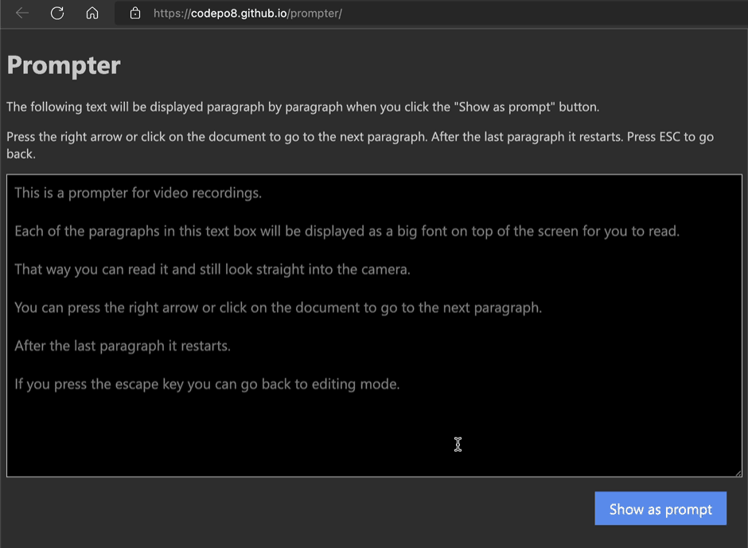
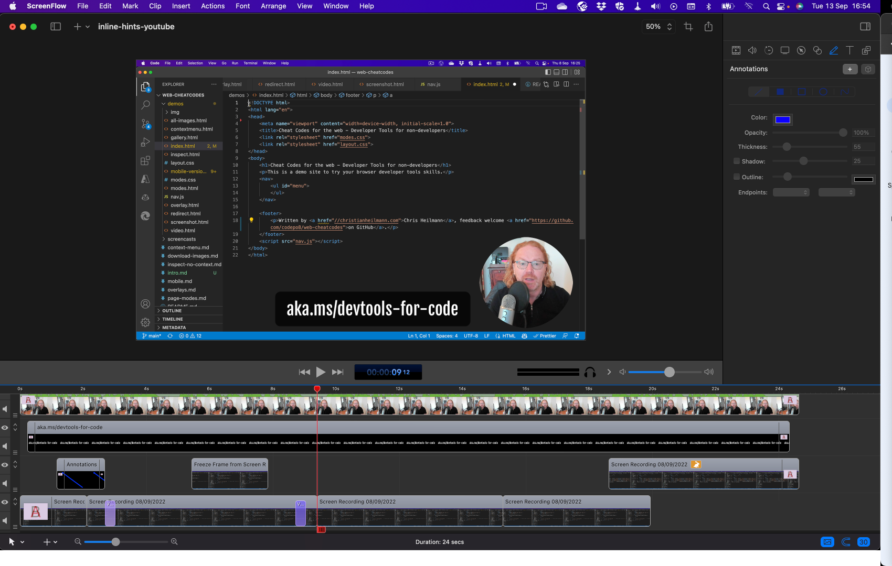

# Creating eductional videos

Video content can be a great way to reach a lot of people and drum up excitement about your products. It is also excellent to show people how something is done when they get stuck. In recent years, video content has become much more successful than writing or long talks. Different platforms and audiences need videos in different formats but seeing that there are hundreds of successful developer video channels on YouTube shows that there is something to this.

There are a lot of software suites that allow you to record your screen, computer audio, camera and microphone. It goes beyond the scope here to list all of them. Personally I use Screenflow on my Apple machine and Camtasia for PC. Regardless of what you use, here are the features that you should look out for:

* Editing capabilities to cut out mistakes and add transitions
* A way to add text and images to your video
* Seperated video streams to mix and match audio and video
* A way to highlight parts of the screen and your mouse cursor
* A way to speed up/slow down parts of the video
* A way to create freeze frames

## Creating super short videos

Many video platforms offer in addition to the long form videos and course tutorials short, informative videos that are easy to consume and should show one thing well. These videos are often called "snackable" content and are a great way to get people interested in your product. You should aim to keep those exciting, short and to the point. A good ballpark figure is to keep them to 40 seconds. I've collaborated with the Visual Studio Code team on a series of short videos that show how to do something in VS Code. They are all around 40 seconds long and show a single feature. They published the videos for me on their TikTok and YouTube channels and they've been huge successes. Here is an example on YouTube:



The first thing to do to create super short videos is to forget that you can do them live. Computers have a penchant to do things wrong as soon as you record something and whilst you fancy yourself a professional, it is amazing how many things you do wrong when you record yourself. Add annoyances like the sound of your keyboard or the fan of your computer starting up when you do something and record at the same time and you got a recipe for annoyance. I have hours of blooper footage of me cursing alternately the computer and myself when something went wrong in the last second of the video.

## Start with the script

The first thing I do before I record a video is to start with the script. This allows me to focus on what I want to show and gauge the overall time it will need to show it. It also helps me to prepare the product I will talk about to show only what is absolutely necessary for this specific video. In the case of the video earlier in this chapter, here is the script I wrote:

> When you use VS Code with the Edge DevTools extension problems in your code show an underline.
You can click those to learn about the problem and you get a light bulb to fix the issue.
For some issues you can ask code to fix it automatically - like adding a missing charset type.
You can also tell it to never report this issue again.
If you don't feel like looking for issues in your code, you can use the problems panel and fix them one by one.

I wrote myself a [prompter script](https://github.com/codepo8/prompter) to see the script one sentence at a time and not have to awkwardly read it in small lettering. You can [try it out here](https://codepo8.github.io/prompter/).

## Record your video and audio

Once you got your script ready, you can record your audio and video. Often I only use the voiceover part of this as my face isn't that important to the subject at hand, but it makes sense to have both. I use a secondary monitor with a camera above it, which means I can read from the prompter and look into the camera at the same time.

Here you can see the video I recorded for the example:



I recorded five takes, removed all the other ones and ended up with a very short video which still feels well paced and not rushed.

## Record a screencast of the feature

The next step is to record a screencast of what you are talking about. I keep the script on a second screen or sometimes listen to the audio of it whilst recording it. The great thing about recording the screencast separately is that you don't need to rush or pace yourself. You can concentrate on doing the best job of interacting with the product to record what you want to show the world. And you can start over as many times as you want to if you didn't get it right or your computer did strange things again. Here again is the raw footage of the above video, showing all the mistakes I did, annoying things that happened and how slow I really am when interacting with the editor.



Record the screen in as high as a resolution as you can, as depending on the format of the final product, you will have to highlight or zoom and pan different parts of the screen. I also tend to zoom the interface a bit as a lot of the audience consuming these "shorts" type videos are on mobile devices. Another big no no is to use full white backgrounds as they are pretty grating to see on a mobile.

## Sync the screencast with your audio/video

The last step is to edit the screencast to pan and zoom to the parts you want to show, add text and image overlays as needed, but - even more importantly - sync it with the audio and video of your recording. This is the most time consuming part of the process and you will have to do it a few times to get it right. The audio and video is the main timeline of the video and you add the screencast on top of it. Cut out the parts that don't match, speed up parts that take too long to match the narration and add freeze frames when there is more to be explained. You can see a timeline of the video earlier here.

The only thing I did to the audio and video recording of myself is add in and out transitions. The screencast has transitions, a zoom and pan callout, a freeze frame to cover annoying editor pop-ups and I sped up the end of it so that the screencast and the narration ends at the same time.

> **Tip:** One thing that is pretty annoying is the portrait format of platforms like Instagram or TikTok for technical videos. What I often do there is to use the same screencast twice in the video - Showing the whole screen in one part of the video and a zoomed/panned/highlighted version in the other. This helps to show where something is in context but also to prevents the viewers from having to squint.