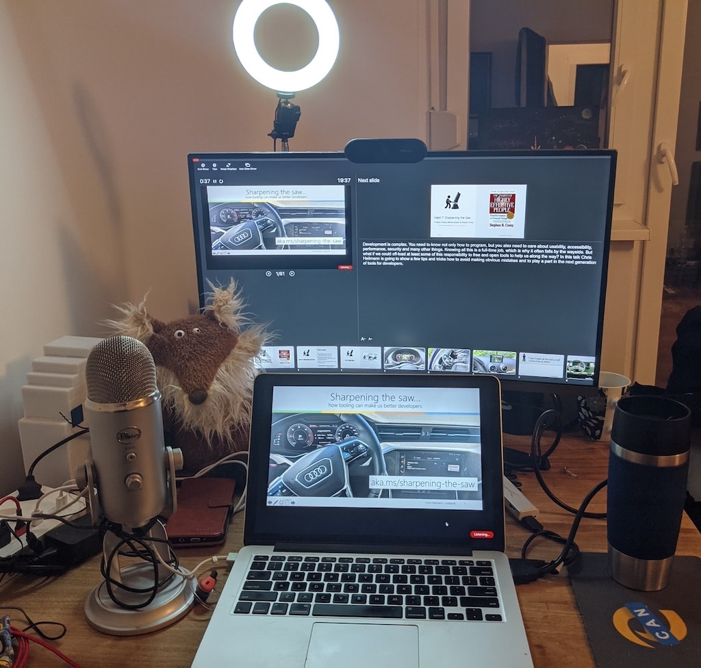

# Working from your own computer

Whilst travel used to be a big part of the developer advocate work in
the last years (and especially with the Covid-19 pandemic) things moved
more to working from home and recording or streaming from your own
computer. This is great and it is getting easier by the day to quickly
show the world what you are working on. The main benefit is that you can
concentrate on your production value. A lot of the randomness and
physically stressful part of travel is gone which means you can do a lot
from the familiar space of your home. You also have predictable
connectivity and can upload materials faster This also comes
with some problems. Not getting any feedback on your delivery can feel
strange and you need to act more as if an audience is there in front of
you. Furthermore, not deliberately going somewhere to present makes it
harder to get into the right mindset. We can do almost any physical
exercise we need at home, and yet we go to gyms. The reason is that we
shift from one mode (being at home) to another (exercising). You need to
find a way to trick yourself into doing that in the case of presenter,
too.

## Get a decent setup

Most laptops have all the things you need to get started to record
videos, screencasts and stream on the web. To get really high quality
recordings, it makes sense though to invest some money on a few extras:

* **External microphones** - if you do a lot of recording or streaming from your device, it makes sense to spend some money on an external microphone. The reason is that they sound a lot better and block out external noise. Another big benefit of external microphones is that you can type and speak/record at the same time without annoying your audience with the clicking sounds of your keyboard.
* **External monitor** - the benefit of having a second monitor is that you can use one screen to record talks and have your speaker notes on the other one. It is also simpler to have the app you want to do a screencast of on the second monitor without any distractions around it.
* **External camera** - for high-end recording it makes sense to have an external camera (which is also great to take to events to do some quick interviews) but at a stretch your mobile phone is also good enough. Having a camera on the secondary monitor also means you will have a nice central camera placement and look at the audience without bending over too much.
* **Proper lighting** - LED ring lights by now are really affordable and positioned behind the laptop or secondary monitor give an excellent look. Avoid any lighting from behind.

Here is what I am using these days:

{:width="1024"
height="976"}

As you can see, there isn't much that is outrageously expensive, but I
manage to get some good results out of it. The fox is there to be the
audience I can't see.

## Screencasts and screenshots

Another powerful tool to show people what you are doing are screencasts
and screenshots. Sometimes a picture explains what you want to achieve
much easier than a bunch of instructions. Step-by-step instructions how
to use a certain interface (for example how to sign up for a developer
key) are easy to show as a screencast. Describing the interface with
words is much harder -- just try to explain people on the phone how to
install some software for example...

Personally I like to keep screencasts small by just filming me going
through some interface but you can jazz them up with voiceover or
embedding your webcam, too.

Most operating systems these days come with in-built screen recording
tools. These can be used to annotate screenshots and take short screen
recordings. Sometimes it makes sense to record a video, other times an
animated GIF is a simpler solution. The tools I use the most are
LiceCap, ScreenToGif, OBS Studio and Screenflow.

There are even browser extensions that allow you to record professional
screencasts. We live in great times.

One important thing in screencasts and screenshots is that you don't
give away sensitive information by showing -- for example -- other
browser tabs, document names and similar things in the background. You
also want to record a setup that is as generic as possible and not your
highly customised one. Often I find it a good idea to have a special,
bare-bones profile on your computer dedicated to recording screencasts
and taking screenshots. If you do things in the browser, I also tend to
go into incognito mode so that my profile name isn't shown.

One trick I do to create smooth looking screencasts is to chunk the work
up into different parts:

* I write myself a script first what I should do. This is also never a waste as it will act as a transcript or text alternative to the screencast later on. Again, being highly accessible is a good thing.
* I then record the audio of the screencast separately to concentrate on pronunciation and pacing.
* As a last step I do a screen recording whilst listening to my audio. In essence I tell myself what to do and then record it.

By separately recording audio and screen I can concentrate on entering
the right information or typing things in the screencast without
stumbling over my own words. I can also deal with connectivity issues or
other problems that happen whilst recording the screen by editing them
out before adding my voice-over.

## Streaming

Most video platforms don't only offer hosting but also a way to stream
these days and many people consider this way of outreach the most
effective. Whilst I am not convinced that a real-time platform because
of its fleeting nature lends itself to training and advocating there is
a huge movement in that space. In any case when it comes to streaming
not the same rules apply than when giving a presentation or creating a
walkthrough. It is much more a conversation with the people in the chat
and reacting to their messages and questions.

In terms of preparing the same rules apply:

* Make sure you don't show things you shouldn't show.
* Don't let people distract you and concentrate on one loud audience member whilst forgetting the others.
* Try to keep to an agenda when showing something.

Streaming audiences are different to those you meet at events or in
workshops. There is a lot of fluctuation and people tend to come and go
in between your session. Don't get discouraged by that and don't get
frustrated if people want to get information you already talked about
earlier.

I found that having a big, organised story to tell like you would in a
presentation doesn't work in this format. Instead, keep a list of things
to show where each makes sense in itself and takes a few minutes to
cover. That way you can pick and choose what to show dependent on the
feedback and questions of people.

In general, streaming is a huge market and people are using it as their
main income. Whilst it can be a good opportunity to try it out for
yourself, it is quite a commitment and you are in for a lot of work to
keep your presence up and stand out of the crowd. Instead of trying to
break into this market it may be easier to get invited by an already
established streaming channel as a guest or take part in an expert chat.

## Taking part in live online chats

A quick and easy thing to do is to jump on a call with a few people and
record or stream the conversations you're having. The way to make those
successful is following the same principles any virtual meeting does:

* Make sure you separate your microphone from your loudspeaker by using headphones. This avoids feedback and you sounding horrible
* Check that nothing shows in your background that could be embarrassing or pose a security risk (whiteboards with information, for example)
* The mute button is your friend. When others are speaking, use it to avoid any breathing or other sounds on your end interrupting the call.
* To avoid people speaking at the same time, it makes sense to agree on a speaking schedule. That is normally the job of a moderator, but lacking one, most conference call systems have a "raise hand" feature. Instead of interrupting others, this is a good way to ask to bring your points up next.
* Most conference call systems also have a chat window where you can type things in. This is not only a great place to post links and resources you talk about or that validate a point of another conference attendee. They are also the lifeline of the conference call. People who have audio/video problems or need to leave are most likely to post something there. Keeping an eye on the chat is pretty important because of that.
* Using your real name in conference calls makes sure there isn't any confusion. Make sure to set it to that. Most systems also have more profile settings and it makes sense to add more information there as people who click on your name will get that information.
* Check that there is a recording of the call. It is important that you watch what you've done afterwards and learn how you can improve.

> **Tip:** You don't need to wait for official conference calls and take part
in those. You can also offer these as a replacement for a brownbag
session.

In any case, getting to know various conference systems is a good idea.
Lately this has been the number one way of communication and currently I
have eight different systems on this computer as every call wanted to
use a different one. Luckily they all work in a similar manner.

## Attending live online events 

With the Covid-19 situation a lot of events moved from being physical to
virtual, which means that you need to give your presentations and
workshops in front of your camera at home. While this is a great thing
as more people can see your talks there are also a lot of opportunities
for things to go wrong.

### Technical issues to prepare for

First of all: forget about a standard stack. I've spoken at twelve
virtual conferences this year and each of them used a different system
for running the event. I've had to install lots of software on my
machine, sign up for trial versions of some to delete later and many
other problems.

Your expensive home connection works flawlessly until you present in
those systems. The best way to plan ahead is to leave 2-3 minutes in
your presentation to deal with outages and things not being visible.
Keep an eye on the chat for people to tell you that they can't see/hear
you and/or the things you present. Nothing is more annoying than having
delivered the perfect talk and nobody saw it as the system lagged
behind.

Screen sharing can also be finicky in these systems. I often was visible
on video just fine but my shared screen kept vanishing. A good plan is
also not to share your whole Desktop but only the app you have your
slides in. This ensures that any other distraction (auto-updating
software, notifications that show up despite you having set your OS to
"do not disturb", and so on) will not show up on the shared screen but
only on your device.

Before you go presenting make sure that all the necessary software to
access the conference system also has access to your device. Operating
systems have become rightfully more stringent in giving access to
camera, microphone, screen recording and folder access. Make sure you
test all these things out and do the necessary modifications before you
start your session.

Some systems allow you to upload your slides to the system and show it
from there instead of sharing your screen. This is a safer bet as when
you can't see the slides, nobody else can either. You don't get a
preferred treatment over your audience.

### Design limitations to prepare for

Your slides will most likely not show full screen, but with your video
next to it. Most conferences will also have some branding frame around
it. This means you have less space to play with and you probably should
also use large enough text for this scenario.

It is also a good idea to avoid animations, transitions, videos and
embedded media in the slides you present in any of these systems. Lag,
pixilation of the screen and many other factors will make them hard to
consume for conference attendees. What runs smoothly on your device is
not what reaches the audience.

Audio and video lag is also a common issue. I found it prudent to
present a bit slower and take more breaks for issues to subside before
continuing.

### Personal issues to prepare for

As there are a lot of issues that can happen it is not the fault of the
organisers, but I have yet to attend a virtual event with live talks
that keeps on schedule. A lot of small issues accumulate and you will
have to be flexible in your presentation times and duration. If you
followed the advice in the presentations chapter you'll be safe as you
have one central story to tell and can, should it be necessary, cut some
parts of your presentation.

When you are on stage, you concentrate on your presentation and you get
feedback from the audience. In virtual live conferences this isn't the
case. Instead, you might have a live chat system showing up next to your
presentation that is much more distraction than help. Try to concentrate
on the delivery of the talk and not let yourself be distracted by all
the things happening around you.

All in all, I've not had great experiences with live presenting in
virtual conference systems, which is why I prefer to record my talk
beforehand. I then let the conference show my video and can concentrate
on the chat and prepare for a live Q&A instead.
