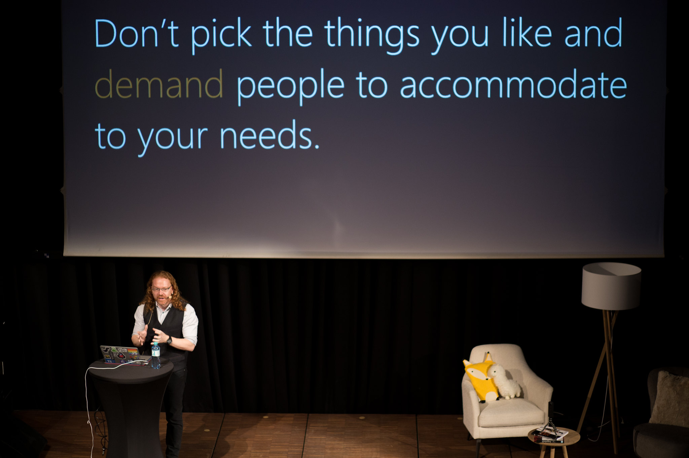

# Working with your competition

## Work with the competition

As a developer advocate you have to keep your independence. Yes, you are
a specialist in the technologies of your company, but if you are
oblivious to the world outside the company and preach a mono-culture you
will not get far.

> **Fact:** Your independence and your integrity is your main power. If
you lost it you are not effective any longer. People should get excited
about what you do because they trust your judgment -- not because you
work for a certain company.

Developers are loyal to solutions and technologies once they are happy
with using them. It is very rare to find a developer who is OK with
jumping from PHP to Java to Ruby to C\# to Python and in between
Windows, Unix and Mac.

On the contrary -- we do spend a large part of our online time bickering
at each other that our favourite language is so much more powerful than
anything else. Quite pointless, really, but it shows that developers
have passion - and passion is a good thing.

The same happens with companies. You get Microsoft fanboys, Google
enthusiasts, Yahoo fans, Apple disciples, Adobe followers and they all
hardly ever mix without arguing with each other about why their
favourite company is the best.

All this means that as soon as you start talking about your brand
exclusively the cards are stacked against you -- either you\'ll preach
to a choir or get shot down in flames.

You work around that in a few ways:

* **Remain an independent voice** -- talk about everything that gets you excited regardless of where it came from.
* **Become a specialist in a certain underlying technology** or methodologies that all these companies and languages rely on.
* **Keep your finger on the pulse** -- have a good collection of news sources to go through daily and tell the world about things you found and tried out.

The fun thing is that every company out there wants to do what you want
to achieve -- make developers happy using their products. Therefore it
is very important that you keep an eye on and in contact with the
competition as much as it is important to be aware of what your own
company is up to.

> **Example:** A really interesting moment happened at a conference. I was
part of a panel of JavaScript framework developers each representing a
certain product. The audience was full of fans of all the different
frameworks and eager to see a big fight on stage. The first thing we did
though was tell the audience that there is no point in comparing and
bickering as all frameworks want to do the same thing -- make web
development more predictable. We even pointed out what we appreciate the
most about the other products. In the end the audience went home with a
much more detailed picture about what each library does better than the
other -- not from the people building it but from their competition.
Everybody won.

## Show respect to the competition

You can\'t be a professional developer advocate and bad-mouth the
competition at the same time. We all are professionals and work on
projects to make people more effective. Different companies have
different approaches and different internal red tape to battle. Pointing
out weaknesses of the competition is a cheap shot.

You should also not forget that we are seemingly working in an industry
that moves and shakes the world but a lot of this is inflation. The
amount of people on the speaking, training and advocating market is very
small and whoever you cross will come back to you very soon. Better to
work together than to annoy each other.

Showing respect and interest also means that -- once you realise that
you can trust another -- you start sharing ideas, resources, conference
opportunities and even give each other sneak previews of things to come.
And that gives everybody an advantage and makes our jobs easier.

It also means that if you are not happy in your current company any
longer, you already have a foot in the door at other opportunities. This
also works the other way around: a tarnished reputation is tough to get
rid of and will follow you around.

## Acknowledge when the competition is better

This is a hard pill to swallow for a lot of people -- especially for
marketing departments -- but bear with me. **If your competition has a
better product than yours and people ask you which one is better do
admit that this is the case**. Whilst this sounds like admitting defeat
in reality it shows a few things you can use to your advantage:

* You come across as someone who appreciates good technology.
* You come across as someone who does not fear competition but welcomes it.
* Your competition feels that they\'ve done an amazing job and will look closer at your products in return.
* You will learn what people love about the competitor\'s product and can feed that back to your own product team.

Another thing to remember is that the product might be better but for a
different audience. What gets developers excited does not necessarily
mean end users can deal with it.

> Example: When I started at Microsoft I took people by surprise by using
a Macbook on stage. I've used Macs for a decade before that and I was
used to them and more efficient using it. The company didn't have any
problem with it as it also changed a lot since the 90s. I now use both a
Macbook and a Surface Laptop and I'm happy with either. The fun thing
though was that being the Microsoft employee not exclusively using our
own products I got people to ask about it. And this is the foot in the
door you need in this job.

## Know about the competition

This is a classic marketing, advertising or even development step:
before you build or promote something look around and do a competitive
analysis.

In the case of developer advocacy you need to be up to speed with what
your peers are up to as you will constantly get questions about it.
\"How does this compare to X, the new product by Y?\" is a very common
first question.

If you can answer that, your tech integrity gets quite a boost and --
let\'s face it -- it is fun to poke at the things our peers produce.

## Build examples using and try out competitive products

Using services and products of your competitors is a great way to check
several things:

* What do they do well, that could be done better in your company\'s services?
* Where do you get stuck? This is something to avoid in your own services.
* How does it compare to your own services? What are the differences? Remember, these are the questions that people will ask you, and you learn best by doing.
* How can these services be mixed with your own and how do they complement each other?

Building something with a brand new API, service or library also helps
your technological integrity and you can feed back problems you found to
your peers in the other company. I\'ve done that with several competitor
products and actually managed to get to know the right people when I
have questions that way.

If you find that a new service or product by another company complements
one of yours nicely, build something that uses both and show that to the
world -- this will be beneficial for both and people see how easy it is
to mix products of various companies. You might even see that people who
promote the other product will use your example as it is already built.

Your biggest success as a developer advocate is to get developers to
talk about your products and promote them for you. This is why you need
to try your best to remove yourself from the brand of your company to be
an example for people. Your company should be seen as interesting enough
for you to work there, not to pay you to be excited.