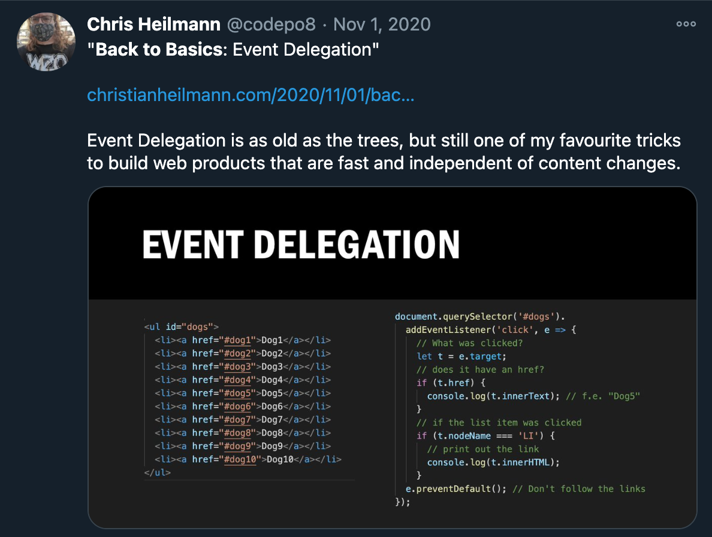

# Write excellent code examples

{:height="898" width="1188"}

Code examples are what makes your posts and articles more relevant to
developers. They say more than dozens of pages about a certain product
and -- even more importantly -- they invite people to play with your
products. You might even often catch yourself looking at a technical
article and scrolling directly to the first code example.

> **Fact:** The success of platforms like StackOverflow show that it makes
sense to keep explanations to the bare minimum and let the
code do the talking. This also has an unfortunate effect that many
developers don't even bother looking at the "why" of code any longer but
happily stick to the "how" and copy and paste code into their own
products. I call these people "Full StackOverflow developers".

## Solve a problem with your example

One of my biggest bug-bears are "hello world" examples that don\'t do
anything useful. Instead I aim to give out code that solves a real
problem.

> **Fact:** "Hello World" code teaches people to write code, but not how
to solve issues with it.

Good code examples should answer the "How does this technology help me
solve a problem?" and not the "How do I use this?" question. The "How do
I use this?" question should be answered by documentation. Code examples
should get people excited about using the product and entice them to
dive into the documentation to find out about the details.

So instead of starting by reading the docs yourself, check what the tool
can do and look for a problem you always wanted to solve that this technology
can help with. Then solve it using the product and explain
what you\'ve done as the code example. This is also an excellent way to
check the validity of your product documentation. If you get stuck as
the developer advocate and you can't find valid documentation this is great.
You have a prime example of how you can help the product by writing that missing
documentation.

## Show a working example

One of the first things to show in a code example is a working
implementation. There is nothing more powerful than a way to see what
the thing does by clicking a link or playing with some data in a form.
You telling the readers that it works is one thing -- the
readers being able to try it out and seeing for themselves is much
more rewarding.

> **Tip:** If the code you explain is part of a larger interface, behind a
firewall or needs authentication then you can still show how it works by
recording a screencast. These are less impactful and could be
considered "fake", but it is better than nothing.

Examples should work but also be pretty and smooth. A lot of examples
fail to please the eye or actually violate a lot of usability basics --
don\'t give a shoddy first impression.

## Explain the necessary environment

One of the things you want to avoid is people getting excited about your
code and then not being able to make it work in their own environment.
You get around this issue in several ways:

* **Write defensive code** -- check for dependencies before trying to access them.
* **Check online and HTTP status** -- If your code needs to pull data from a web service say that the user needs to be online to run it. For example I\'ve had many a complaint that some of my JavaScript examples don\'t work offline or without running a local server. Obviously I failed to explain that it needs live data and that for security reasons some functionality of JavaScript is only available when accessed over HTTPS and not on the file system.
* **List what is needed** -- say what your dependencies are. For example. "needs Node and npm" or "Runs in Microsoft Edge version 85 and newer". If third party dependencies are needed, find a good tutorial for your readers to install them and link the name of the dependency to it.
* **Provide a simple test script** that checks for the right setup. (For an example see the [test file for GeoMaker](http://github.com/codepo8/GeoMaker/blob/3d88e693698965b802539d2a467e05f1f67cff76/test.php)).

* **Provide a developer key for the demo** -- but make it obvious to tell people that to implement your code they\'d need an own key. Provide a link where to apply for one.

You won\'t be able to predict all things people can do wrong when
implementing your code but these are some good ways of preventing
frustration. Which brings me to an important part of code examples:
allowing for copy and paste.

## Write working copy and paste code

Copy and paste is probably the most used way of learning code. You can
write documentation until your fingers bleed, but the biggest use case
is that developers will check a code example, copy and paste it, fiddle
around with it until they get stuck and then start reading the docs.

> **Fact:** It is immensely important to **write clean copy and paste
examples**. Any bad coding habit you add in your code will be copied and
become part of a live implementation.

Copy and paste examples that don\'t work are not only useless but also
disastrous to your reputation and very frustrating for implementers.
Make sure that the following points are covered:

* **Link all resources** -- point images, CSS and script resources to web locations rather than linking them locally or relative. People will copy the code and paste it in a local project and not download the dependencies.
* **Provide the full script upfront** -- people will copy and paste chunks of a script and complain that they don\'t work without realising that other parts are missing.
* **Validate and secure your code** -- copy and paste code needs to be excellent. Make sure your code plays well with other code and doesn\'t cause any warnings or errors.

## Have the example as a download

Providing the demo code for download as a zip file should be one of the
first things you do in your example. You can ask readers to download,
unpack it and code along with you. This works well with screencasts and
video tutorials. In any case it keeps your article in the mind of the
readers as they have something on their hard drives reminding them of
it.

Offering a zipped version of your demo code can be annoying as every change means you have to re-pack the demos. Luckily hosted code solutions
like [GitHub](http://github.com) do this job for you automatically.

## Write clean and clever examples

Again, I cannot stress enough that **your code examples should be the
cleanest and cleverest code you ever write**. It is very tempting to
show a quick and dirty solution to get people going and earn immediate
kudos for creating the shortest code. But this is what coders do to
impress each other and not what developer advocates do.

You want to **show how to write excellent solutions** with the product
you advocate and every shortcut you take will be copied and taken as an
excuse not to write excellent code in live projects. This is not what we
are here for.

On the contrary -- demo code can advertise best development practices
and show them in context rather than as an academic exercise.
Showing a JavaScript that protects scope by using the Module pattern and
uses closures cleverly allows you to cross-link to these ideas and maybe
get some developers to take them on as part of their coding habits.

## Build code generators

A nice touch to add to a solution are code generators that allow
implementers to add some parameters, hit a button and get the code
they wanted. This is amazingly powerful.

There is a danger is that some people will never bother learning the
real implementation tricks. On the other hand these readers are not
likely to do that anyways. In any case you\'ll get a lot more people
look at the product.

## Hosting code and demos

It might be tempting to host your code and demos on a personal server,
and I have done this for years now myself. The great thing about that is
that you control the server. The bad thing about that is that it is up
to you to maintain that server. And you want to spend your time
advocating, not as a server admin.

> **Warning:** I've been using my server as a playground for years and that's
also painfully obvious when I look at the state of it. Some of my code
from the past ended up being excellent attack vectors and at one time
one of my AJAX demos from 2006 ended up allowing for a spam blog being
installed in one deeply hidden folder. This also meant that Google
blocked my domain and many other issues.

Having a playground server is great, but it should also be obvious to
you and the people who look at your code that it is a scratchpad. The
code there can and will go away any time. It makes sense to consider a
more maintained and controlled way to publish your demos and code
examples.

### Version Control is your friend

The first thing I found that saved me a lot of hassle is to use version
control for everything. Git is the common thing to use, but even having
your products in a OneDrive / Dropbox / Box / Google Drive or whatever folder
is a great idea. You will always mess up and it is great to be able
to revert a last change on a file.

> **Fact:** As it turns out, using Git also means you save space on your hard
drive as you don't create Zip files called "test123-safety-still-works"
or a folder structure where each folder is a version name and a date.

Using version control systems has been daunting in the past but with the
emergence of Git and hosting solutions like GitHub and Gitlab things
have become easier. The other practical upshot of Git is that you are
forced to comment on commits. You thus create a history of changes you
can use to describe the code to potential maintainers or people you want
to educate.

Furthermore, having an open source hosting presence like a GitHub
profile is an excellent way to get people to find your code examples and
courses, contribute to them and give you in-context feedback. Problems
reported as issues on a platform like this are much easier to understand
than random feedback via email or social media platforms. No matter
where you put up camp, it is important that you don't rely on a free
tier but get a better, serviced presence on the platform. These aren't
that expensive, and you don't want to end up in a situation where
your code becomes inaccessible as you reached a certain limit or the
platform changes.

> **Tip:** This is an important point. Any platform you choose should be a
backup and a way for people to find you. You shouldn't host things where
you can't at any time get a backup of all your data to move it
elsewhere. Our market keeps shifting, so make sure you don't get
dependent on a resource that may be gone soon and with it all your work.

> **Fact:** Code sharing platforms based on Git are by design compatible with each
other, so that's something that should give you some security. These
platforms are also highly optimised to serve and deliver code, much like
YouTube and similar services are optimised for media streaming.

One of my main annoyances about telling people about code is that you
need to have executable code and readable code in your tutorials and
documentation. I've spent years changing code that works well to display
correctly in blogging platforms and books. By hosting your examples with
platforms like these, this isn't an issue at all.

### Automated Hosting

Code hosting platforms don't only allow you to store your code and make
it accessible to people. These platforms also have built-in feedback
mechanisms and people can take your code, take a copy and change it right
there and then to their needs.

For you, there are also options to add a wiki and documentation.
Even more importantly, most of these platforms don't only allow you to
host your code, but also to execute it. This, naturally, comes with a few
limitations. You can show HTML, CSS and JavaScript on almost any of
these platforms. Server-side executable code is harder to find a place
for, but there are some that also allow for full application hosting
together with the source.

Most platforms will have some static site generation tool included, like
[Gatsby](https://www.gatsbyjs.com/), [Jekyll](https://jekyllrb.com/)
or similar ones. If you are reading this book online,
this is what I used. The texts here are in markdown and I am using
[GitHub pages](https://pages.github.com/) with Jekyll to generate HTML.

### Code Sandboxes

Other than platforms that are there to host your code and
products there are also code sandbox services available. These allow you
to write a code example and share it as source and executable with the
world. These platforms are the editor and the place to see the results
in one and are highly optimised for exactly that use case. As an extra
bonus, they also allow you to embed the code example in blog
posts and articles.

[JSFiddle](https://jsfiddle.net/) was one of the first, later on
[JSBin](https://jsbin.com/) took off and [Codepen](https://codepen.io/)
is another big player in the space. A great thing about any of them is
that they do not only allow you to write basic web code, but also offer
you precompilers so you can concentrate on showing people how a certain
abstraction works without having to talk them through the setup and
customisation of the abstraction library. When I worked at the Mozilla
Web Docs team, we found that people trying the code directly
where the explanations are was a big winner.

Often during trainings you might end up with a group that can't install
any software on their computers because of company policies. By using
these services you can still run your course as all the attendees need
to have is a browser and a connection.

### Live coding environments

Many of these platforrms also have a presentation and a live mode which
allows you to develop in real time with other people, much like you can
use Office 365 and Google Docs to collaboratively write texts. [Code Sandbox](https://codesandbox.io/), [Glitch](https://glitch.com/) and
many others specialise in that and both Codepen and JSBin also have
upgraded their feature sets to allow for this use case.

Live coding environments are excellent to show something to a potential
customer who considers booking you for a workshop or presentation. They
are also superb to create a simple use case and hash out a problem with
a team anywhere in the world. Not surprisingly, they are also often
used during interviews.

### Code showcases

Some of these platforms have done a great job to build a community
around code examples. Codepen, for example, is a treasure trove of
finding examples to add to your presentations and explain what
technologies enabled them. It is important to give credit where credit
is due, though. You can also take part and make a name for yourself by
showing cool things off there.

Often these examples play with newest technologies and are a great way
for you as a developer advocate to show their worth to prospective other
users. And, after all, they are fun to play with. I found quite a lot of
interesting people to share information with looking through showcase
sites and some of the demos were instrumental in making browsers I
worked in perform better as they were taxing to the rendering engines.