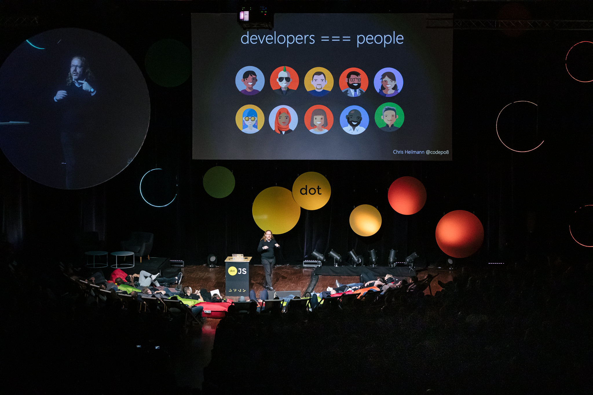

{:height="1024" width="683"}

This handbook will get you on the way to be a great developer advocate
for any product or company. Naturally, your approach may need tweaking for
different markets and audiences - and in accordance with your own
personality - but the main principles are the same for everybody and
anywhere in the world.

This is a new, 2020 version of this 11 year old book and I added quite a few new chapters and removed outdated materials. You can read more about this in the [about section](about).

Now, why not get right into it? Choose from the [table of contents](toc) or [read the book](what-is-developer-advocacy).

<small>Photo from the DotJS2019 talk [Develop, Debug, Learn?](https://www.youtube.com/watch?v=m4t7cLFksls)</small>
